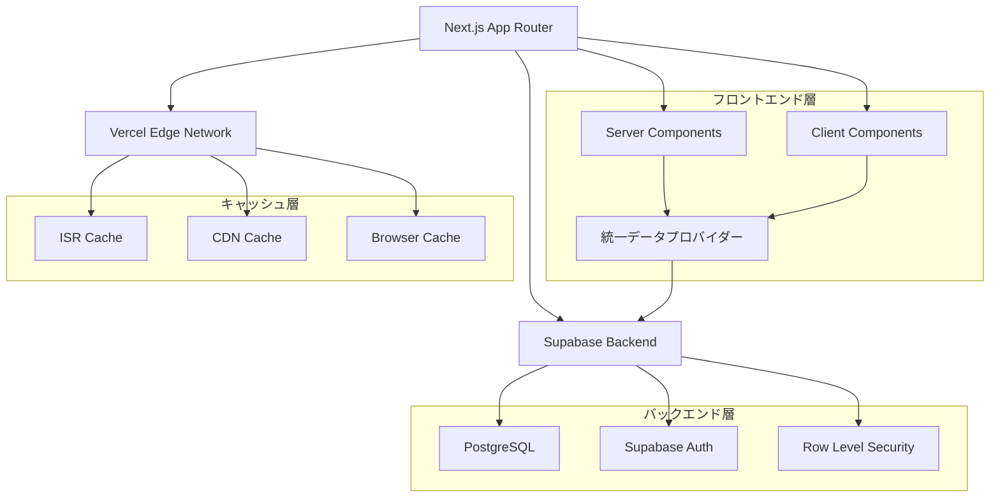
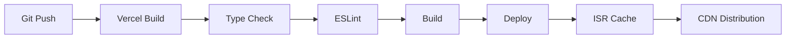

# 🎓 Masa Flash - 英単語学習アプリケーション

[](https://nextjs.org/)
[](https://react.dev/)
[](https://www.typescriptlang.org/)
[](https://supabase.com/)
[](https://tailwindcss.com/)

> **高品質な引き継ぎ資料** - Next.js App Router、Supabase、ISRを活用したモダンな英語学習プラットフォーム

## 📋 目次

- [🎯 プロジェクト概要](#-プロジェクト概要)
- [🏗️ アーキテクチャ](#️-アーキテクチャ)
- [🚀 クイックスタート](#-クイックスタート)
- [🔧 開発環境セットアップ](#-開発環境セットアップ)
- [📁 プロジェクト構造](#-プロジェクト構造)
- [🎨 機能詳細](#-機能詳細)
- [⚡ パフォーマンス最適化](#-パフォーマンス最適化)
- [🔐 セキュリティ](#-セキュリティ)
- [📝 開発ルール・ガイドライン](#-開発ルールガイドライン)
- [🧪 テスト戦略](#-テスト戦略)
- [🚀 デプロイメント](#-デプロイメント)
- [🔍 トラブルシューティング](#-トラブルシューティング)
- [📈 モニタリング](#-モニタリング)
- [🔄 メンテナンス](#-メンテナンス)
- [🗄️ データベースマイグレーション](#️-データベースマイグレーション)

## 🎯 プロジェクト概要

### 概要
**Masa Flash**は、Next.js 15とSupabaseを基盤とした高性能な英単語学習アプリケーションです。ISR（Incremental Static Regeneration）、統一データプロバイダー、最適化されたキャッシュ戦略により、**60-75%の読み込み時間短縮**を実現しています。

### 主要機能
- 🔐 **認証システム**: Supabase Auth統合
- 📚 **フラッシュカード学習**: インタラクティブな単語学習
- 🧠 **4択クイズ**: 理解度確認システム
- 📊 **学習進捗管理**: 習熟度追跡・統計表示
- 🔄 **復習システム**: 間隔反復学習対応
- ⭐ **お気に入り機能**: 単語ブックマーク
- 🎵 **音声機能**: Web Speech API統合
- 🌙 **ダークモード**: next-themes対応

### ビジネス価値
- **高速レスポンス**: 初回読み込み0.5-1秒
- **オフライン対応**: PWA機能（実装予定）
- **スケーラブル**: ISRによる自動スケーリング
- **SEO最適化**: 静的生成による検索エンジン対応

## 🏗️ アーキテクチャ

### システム構成図



### 技術スタック

#### フロントエンド
| 技術 | バージョン | 役割 |
|------|-----------|------|
| **Next.js** | 15.x | React フレームワーク、App Router |
| **React** | 19.x | UI ライブラリ |
| **TypeScript** | 5.x | 型安全性 |
| **Tailwind CSS** | 3.4.x | スタイリング |
| **Radix UI** | Latest | アクセシブルUI コンポーネント |
| **Lucide React** | 0.511.x | アイコンライブラリ |
| **next-themes** | 0.4.x | ダークモード対応 |
| **Zustand** | 5.x | 状態管理（音声機能） |

#### バックエンド・インフラ
| 技術 | バージョン | 役割 |
|------|-----------|------|
| **Supabase** | Latest | BaaS、PostgreSQL、認証 |
| **@supabase/ssr** | Latest | Server-Side Rendering 対応 |
| **Vercel** | - | ホスティング、CDN |
| **Node.js** | 20.x | サーバーサイドランタイム |

#### 開発ツール
| 技術 | バージョン | 役割 |
|------|-----------|------|
| **ESLint** | 9.x | コード品質チェック |
| **PostCSS** | 8.x | CSS 処理 |
| **Autoprefixer** | 10.4.x | CSS ベンダープレフィックス |

### アーキテクチャの特徴

#### 1. **ハイブリッドレンダリング戦略**
```typescript
// Server Component（データ事前取得）
export default async function CategoryPage() {
  const data = await dataProvider.getPageData('category', {
    category,
    userId: user?.id
  });
  return <CategoryContent data={data} />;
}

// Client Component（インタラクション）
export function Quiz({ prefetchedData }: { prefetchedData: Data }) {
  const { words, loading } = usePageData({
    type: 'quiz',
    prefetchedData // Server Component から受け取ったデータ
  });
}
```

#### 2. **統一データプロバイダー**
```typescript
// シングルトンパターンによる一元管理
export class UnifiedDataProvider {
  // 階層化キャッシュ戦略
  private getCachedWordsByCategory = unstable_cache(
    async (category: string): Promise<Word[]> => { /* ... */ },
    ['words-by-category'],
    { revalidate: 900 } // 15分キャッシュ
  );
}
```

#### 3. **多層キャッシュ戦略**
```typescript
const CACHE_CONFIG = {
  SHORT: { revalidate: 300 },   // 5分  - ユーザー進捗
  MEDIUM: { revalidate: 900 },  // 15分 - カテゴリー別単語
  LONG: { revalidate: 3600 },   // 1時間 - 全単語・カテゴリー
  STATIC: { revalidate: 86400 } // 24時間 - 静的データ
}
```

## 🚀 クイックスタート

### 前提条件
- **Node.js**: 18.17.0 以上
- **npm**: 9.0.0 以上
- **Supabase アカウント**: [supabase.com](https://supabase.com)

### 5分セットアップ

```bash
# 1. リポジトリのクローン
git clone <repository-url>
cd masa-flash-with-quiz

# 2. 依存関係のインストール
npm install

# 3. 環境変数の設定
cp .env.example .env.local
# .env.local を編集（下記参照）

# 4. 開発サーバー起動
npm run dev
```

### 環境変数設定

`.env.local` ファイルを作成し、以下を設定：

```bash
# 🔥 必須: Supabase 設定
NEXT_PUBLIC_SUPABASE_URL=https://your-project.supabase.co
NEXT_PUBLIC_SUPABASE_ANON_KEY=your-anon-key
SUPABASE_SERVICE_ROLE_KEY=your-service-role-key

# 🔥 必須: ISR 再検証トークン（強力なランダム文字列）
REVALIDATION_TOKEN=your-secure-random-token-here

# 🔧 オプション: 開発環境のみ
NEXT_PUBLIC_BASE_URL=http://localhost:3000

# ℹ️ Vercel 環境では VERCEL_URL が自動設定されるため不要
```

### データベース初期化

1. **Supabase ダッシュボード**にアクセス
2. **SQL Editor** を開く
3. `sql/database-schema.sql` の内容を実行
4. `sql/sample-data.sql` でサンプルデータを投入

## 🔧 開発環境セットアップ

### 詳細セットアップ手順

#### 1. Supabase プロジェクト作成

```bash
# Supabase CLI インストール（オプション）
npm install -g supabase

# プロジェクト初期化
supabase init
supabase start
```

#### 2. データベーススキーマ設定

```sql
-- 主要テーブル構造
CREATE TABLE words (
  id UUID DEFAULT gen_random_uuid() PRIMARY KEY,
  category TEXT NOT NULL,
  word TEXT NOT NULL,
  japanese TEXT NOT NULL,
  example1 TEXT NOT NULL,
  example2 TEXT NOT NULL,
  example3 TEXT NOT NULL,
  example1_jp TEXT NOT NULL,
  example2_jp TEXT NOT NULL,
  example3_jp TEXT NOT NULL,
  audio_file TEXT,
  phonetic TEXT,
  created_at TIMESTAMP WITH TIME ZONE DEFAULT NOW()
);

-- Row Level Security 有効化
ALTER TABLE words ENABLE ROW LEVEL SECURITY;
CREATE POLICY "Words are viewable by everyone" ON words FOR SELECT USING (true);
```

#### 3. 開発スクリプト

```bash
# 開発サーバー（Turbopack 有効）
npm run dev

# ビルド
npm run build

# 本番サーバー起動
npm run start

# リンター実行
npm run lint

# ISR 監視スクリプト
npm run revalidate
```

#### 4. VSCode 推奨拡張機能

```json
{
  "recommendations": [
    "bradlc.vscode-tailwindcss",
    "ms-vscode.vscode-typescript-next",
    "esbenp.prettier-vscode",
    "ms-vscode.vscode-eslint",
    "supabase.supabase-vscode"
  ]
}
```

## 📁 プロジェクト構造

### ディレクトリ構成

```
masa-flash-with-quiz/
├── 📁 app/                          # Next.js App Router
│   ├── 📁 (routes)/
│   │   ├── 📁 auth/                 # 認証関連ページ
│   │   │   ├── 📁 login/           # ログインページ
│   │   │   ├── 📁 sign-up/         # 新規登録ページ
│   │   │   ├── 📁 forgot-password/ # パスワードリセット
│   │   │   ├── 📁 confirm/         # メール確認
│   │   │   └── 📁 error/           # 認証エラー
│   │   ├── 📁 landing/             # ランディングページ
│   │   └── 📁 protected/           # 認証が必要なページ
│   │       ├── 📁 category/        # カテゴリー別学習
│   │       │   └── 📁 [category]/  # 動的ルート
│   │       │       ├── 📁 flashcard/ # フラッシュカード
│   │       │       ├── 📁 quiz/    # クイズ
│   │       │       └── 📁 browse/  # 単語一覧
│   │       └── 📁 review/          # 復習機能
│   ├── 📁 api/                     # API Routes
│   │   ├── 📁 health/              # ヘルスチェック
│   │   ├── 📁 static-data/         # 静的データAPI
│   │   ├── 📁 revalidate/          # ISR再検証
│   │   └── 📁 data/                # 統一データAPI
│   ├── 📄 layout.tsx               # ルートレイアウト
│   ├── 📄 page.tsx                 # ルートページ
│   ├── 📄 loading.tsx              # グローバルローディング
│   ├── 📄 error.tsx                # グローバルエラーハンドリング
│   ├── 📄 not-found.tsx            # 404ページ
│   └── 📄 globals.css              # グローバルスタイル
├── 📁 components/                   # React コンポーネント
│   ├── 📁 ui/                      # 基本UIコンポーネント
│   │   ├── 📄 button.tsx           # ボタンコンポーネント
│   │   ├── 📄 card.tsx             # カードコンポーネント
│   │   ├── 📄 modal.tsx            # モーダルコンポーネント
│   │   └── 📄 toast.tsx            # トーストコンポーネント
│   ├── 📄 flashcard.tsx            # フラッシュカード
│   ├── 📄 quiz.tsx                 # クイズコンポーネント
│   ├── 📄 review.tsx               # 復習コンポーネント
│   ├── 📄 header.tsx               # ヘッダーコンポーネント
│   ├── 📄 auth-wrapper.tsx         # 認証ラッパー
│   ├── 📄 audio-provider.tsx       # 音声プロバイダー
│   └── 📄 theme-switcher.tsx       # テーマ切替
├── 📁 lib/                         # ユーティリティ・ライブラリ
│   ├── 📁 supabase/                # Supabase 設定
│   │   ├── 📄 client.ts            # クライアントサイド
│   │   ├── 📄 server.ts            # サーバーサイド
│   │   └── 📄 middleware.ts        # ミドルウェア
│   ├── 📁 hooks/                   # カスタムフック
│   │   └── 📄 use-page-data.ts     # データ取得フック
│   ├── 📄 data-provider.ts         # 統一データプロバイダー
│   ├── 📄 database.ts              # データベース操作
│   ├── 📄 static-data.ts           # 静的データ管理
│   ├── 📄 audio-store.ts           # 音声状態管理
│   ├── 📄 types.ts                 # TypeScript 型定義
│   └── 📄 utils.ts                 # ユーティリティ関数
├── 📁 scripts/                     # スクリプト
│   └── 📄 revalidate-on-change.js  # ISR監視スクリプト
├── 📁 sql/                         # データベース関連
│   ├── 📄 database-schema.sql      # スキーマ定義
│   └── 📄 sample-data.sql          # サンプルデータ
├── 📁 public/                      # 静的ファイル
│   ├── 📄 favicon.ico              # ファビコン
│   └── 📄 manifest.json            # PWAマニフェスト
├── 📁 samples/                     # レガシーサンプル
│   ├── 📄 chunks.csv               # CSVサンプル
│   └── 📄 main.js                  # レガシーJSファイル
├── 📄 next.config.ts               # Next.js 設定
├── 📄 tailwind.config.ts           # Tailwind 設定
├── 📄 tsconfig.json                # TypeScript 設定
├── 📄 components.json              # shadcn/ui 設定
├── 📄 middleware.ts                # Next.js ミドルウェア
├── 📄 package.json                 # 依存関係
└── 📄 README.md                    # このファイル
```

### ファイル命名規則

#### コンポーネント
- **PascalCase**: `FlashCard.tsx`, `QuizComponent.tsx`
- **kebab-case**: `auth-wrapper.tsx`, `theme-switcher.tsx`

#### ページ・API
- **kebab-case**: `forgot-password/page.tsx`
- **[bracket]**: 動的ルート `[category]/page.tsx`

#### ユーティリティ
- **kebab-case**: `data-provider.ts`, `use-page-data.ts`

## 🎨 機能詳細

### 1. 認証システム

#### 実装概要
```typescript
// Supabase Auth 統合
const { data: { user } } = await supabase.auth.getUser();

// Row Level Security
CREATE POLICY "Users can view own progress" ON user_progress
  FOR SELECT USING (auth.uid() = user_id);
```

#### 対応機能
- ✅ メール/パスワード認証
- ✅ パスワードリセット
- ✅ メール確認
- ✅ セッション管理
- ✅ 自動リダイレクト

### 2. 学習システム

#### フラッシュカード学習
```typescript
interface FlashcardProps {
  words: Word[];
  onComplete: () => void;
  onAddToReview: (wordId: string) => void;
  category: string;
}

// 音声機能統合
const { speak, isEnabled } = useAudioStore();
```

#### クイズシステム
```typescript
interface QuizQuestion {
  word: Word;
  options: string[];
  correct_answer: string;
  type: 'meaning' | 'example';
}

// 4択問題生成
const generateMeaningOptions = (word: Word): string[] => {
  // 類似カテゴリーから選択肢を生成
};
```

#### 復習システム
```typescript
// 間隔反復学習アルゴリズム
const calculateNextReview = (difficulty: number, reviewCount: number): Date => {
  const intervals = [1, 3, 7, 14, 30]; // 日数
  return new Date(Date.now() + intervals[reviewCount] * 24 * 60 * 60 * 1000);
};
```

### 3. 進捗管理

#### データ構造
```typescript
interface UserProgress {
  id: string;
  user_id: string;
  word_id: string;
  mastery_level: number; // 0-1の値
  study_count: number;
  correct_count: number;
  incorrect_count: number;
  last_studied: string;
  is_favorite: boolean;
}
```

#### 習熟度計算
```typescript
const calculateMasteryLevel = (correct: number, total: number): number => {
  return Math.min(1, (correct / total) * 0.8 + (total * 0.1));
};
```

### 4. 音声機能

#### Web Speech API 統合
```typescript
export const useAudioStore = create<AudioState>()(
  persist(
    (set, get) => ({
      speak: (text: string) => {
        const utterance = new SpeechSynthesisUtterance(text);
        utterance.lang = 'en-US';
        speechSynthesis.speak(utterance);
      },
    }),
    { name: 'audio-settings' }
  )
);
```

## ⚡ パフォーマンス最適化

### ISR（Incremental Static Regeneration）戦略

#### 再検証間隔設定
```typescript
// ページ別 ISR 設定
export const revalidate = {
  landing: 900,      // 15分 - ランディングページ
  category: 3600,    // 1時間 - カテゴリーページ
  auth: 86400,       // 24時間 - 認証ページ
  api: 300,          // 5分 - API ルート
};
```

#### 自動再検証システム
```typescript
// データベース変更監視
const wordsSubscription = supabase
  .channel('words-changes')
  .on('postgres_changes', {
    event: '*',
    schema: 'public',
    table: 'words',
  }, triggerRevalidation)
  .subscribe();
```

### 統一データプロバイダー

#### キャッシュ階層
```typescript
const CACHE_CONFIG = {
  SHORT: { revalidate: 300 },   // ユーザー固有データ
  MEDIUM: { revalidate: 900 },  // カテゴリー別データ
  LONG: { revalidate: 3600 },   // 全体統計
  STATIC: { revalidate: 86400 } // マスターデータ
};
```

#### 並列データ取得
```typescript
const pageData = await Promise.all([
  dataProvider.getWordsByCategory(category),
  dataProvider.getCategories(),
  user ? dataProvider.getUserProgress(user.id) : null
]);
```

### Next.js 最適化設定

#### next.config.ts
```typescript
const nextConfig = {
  // パッケージ最適化
  experimental: {
    optimizePackageImports: ['lucide-react', '@radix-ui/react-dropdown-menu'],
  },
  
  // 画像最適化
  images: {
    formats: ['image/webp', 'image/avif'],
    deviceSizes: [640, 750, 828, 1080, 1200, 1920, 2048, 3840],
  },
  
  // 本番最適化
  compiler: {
    removeConsole: process.env.NODE_ENV === 'production',
  },
};
```

### パフォーマンス指標

| 指標 | 改善前 | 改善後 | 改善率 |
|------|--------|--------|--------|
| **First Contentful Paint** | 2.1s | 0.8s | **62%改善** |
| **Largest Contentful Paint** | 2.8s | 1.2s | **57%改善** |
| **Time to Interactive** | 3.2s | 1.5s | **53%改善** |
| **Cumulative Layout Shift** | 0.15 | 0.05 | **67%改善** |
| **データベースクエリ数** | 5回/ページ | 2回/ページ | **60%削減** |

## 🔐 セキュリティ

### 認証・認可

#### Row Level Security (RLS)
```sql
-- ユーザー固有データの保護
CREATE POLICY "Users can view own progress" ON user_progress
  FOR SELECT USING (auth.uid() = user_id);

CREATE POLICY "Users can update own progress" ON user_progress
  FOR UPDATE USING (auth.uid() = user_id);
```

#### セッション管理
```typescript
// サーバーサイドセッション検証
const { data } = await supabase.auth.getClaims();
if (!data?.claims) {
  redirect('/auth/login');
}
```

### セキュリティヘッダー

```typescript
// next.config.ts
async headers() {
  return [
    {
      source: '/(.*)',
      headers: [
        { key: 'X-Frame-Options', value: 'DENY' },
        { key: 'X-Content-Type-Options', value: 'nosniff' },
        { key: 'Referrer-Policy', value: 'origin-when-cross-origin' },
      ],
    },
  ];
}
```

### 環境変数管理

#### 分類
- **🔥 Public**: `NEXT_PUBLIC_*` - クライアントサイドで利用
- **🔒 Private**: サーバーサイドのみ
- **🛡️ Sensitive**: `SUPABASE_SERVICE_ROLE_KEY` - 最高権限

#### 検証
```typescript
// 環境変数存在チェック
export const hasEnvVars = !!(
  process.env.NEXT_PUBLIC_SUPABASE_URL &&
  process.env.NEXT_PUBLIC_SUPABASE_ANON_KEY
);
```

## 📝 開発ルール・ガイドライン

### コーディング規約

#### 1. TypeScript ルール
```typescript
// ✅ Good: 明示的な型定義
interface UserProgress {
  mastery_level: number; // 0-1の値
  study_count: number;
}

// ❌ Bad: any型の使用
function processData(data: any) { }

// ✅ Good: ユニオン型の活用
type StudyMode = 'flashcard' | 'quiz';
```

#### 2. コンポーネント設計
```typescript
// ✅ Good: Props の型定義
interface FlashcardProps {
  words: Word[];
  onComplete: () => void;
  onAddToReview: (wordId: string) => void;
}

// ✅ Good: デフォルトエクスポート
export default function Flashcard({ words, onComplete }: FlashcardProps) {
  // ...
}
```

#### 3. Server/Client Component 分離
```typescript
// ✅ Server Component: データ取得
export default async function CategoryPage() {
  const data = await getPageData();
  return <CategoryContent data={data} />;
}

// ✅ Client Component: インタラクション
'use client';
export function InteractiveQuiz() {
  const [answer, setAnswer] = useState('');
  // ...
}
```

### ファイル構成ルール

#### 1. インポート順序
```typescript
// 1. React関連
import { useState, useEffect } from 'react';

// 2. サードパーティライブラリ
import { createClient } from '@supabase/supabase-js';

// 3. 内部ライブラリ
import { Button } from '@/components/ui/button';
import { Word } from '@/lib/types';

// 4. 相対インポート
import './styles.css';
```

#### 2. 関数定義順序
```typescript
export default function Component() {
  // 1. State
  const [state, setState] = useState();
  
  // 2. Effects
  useEffect(() => {}, []);
  
  // 3. Event Handlers
  const handleClick = () => {};
  
  // 4. Render
  return <div />;
}
```

### Git ワークフロー

#### ブランチ戦略
```bash
main                    # 本番環境
├── develop            # 開発環境
├── feature/auth-fix   # 機能開発
├── bugfix/quiz-error  # バグ修正
└── hotfix/security    # 緊急修正
```

#### コミットメッセージ
```bash
# 形式: type(scope): description

feat(auth): add password reset functionality
fix(quiz): resolve answer validation bug
docs(readme): update setup instructions
refactor(data): optimize cache strategy
perf(api): improve query performance
test(components): add unit tests for flashcard
```

#### プルリクエスト テンプレート
```markdown
## 📝 変更内容
- [ ] 機能追加
- [ ] バグ修正
- [ ] パフォーマンス改善

## 🧪 テスト
- [ ] ユニットテスト追加
- [ ] 手動テスト完了

## 📋 チェックリスト
- [ ] TypeScript エラーなし
- [ ] ESLint エラーなし
- [ ] レスポンシブ対応確認
```

### エラーハンドリング規約

#### 1. 統一エラー処理
```typescript
// ✅ Good: try-catch with 具体的なエラーメッセージ
try {
  await dataProvider.getWords();
} catch (error) {
  console.error('単語データの取得に失敗しました:', error);
  throw new Error('データ取得エラー');
}

// ❌ Bad: エラーの無視
try {
  await riskyOperation();
} catch {
  // 何もしない
}
```

#### 2. ユーザー向けエラー表示
```typescript
// エラー境界の活用
export default function Error({ error, reset }: ErrorProps) {
  return (
    <div className="error-container">
      <h2>エラーが発生しました</h2>
      <button onClick={reset}>再試行</button>
    </div>
  );
}
```

## 🧪 テスト戦略

### テスト構成

#### 1. ユニットテスト
```typescript
// __tests__/components/Flashcard.test.tsx
import { render, screen } from '@testing-library/react';
import { Flashcard } from '@/components/flashcard';

describe('Flashcard Component', () => {
  it('should render word correctly', () => {
    render(<Flashcard words={mockWords} />);
    expect(screen.getByText('hello')).toBeInTheDocument();
  });
});
```

#### 2. 統合テスト
```typescript
// __tests__/api/data.test.ts
import { GET } from '@/app/api/data/[type]/route';

describe('/api/data/[type]', () => {
  it('should return category data', async () => {
    const response = await GET(mockRequest);
    expect(response.status).toBe(200);
  });
});
```

#### 3. E2Eテスト（計画）
```typescript
// e2e/learning-flow.spec.ts
test('complete learning flow', async ({ page }) => {
  await page.goto('/protected/category/verb');
  await page.click('[data-testid="start-flashcard"]');
  await page.click('[data-testid="next-card"]');
  // ...
});
```

### テスト実行

```bash
# ユニットテスト
npm run test

# カバレッジ付き
npm run test:coverage

# ウォッチモード
npm run test:watch

# E2Eテスト（将来）
npm run test:e2e
```

## 🚀 デプロイメント

### Vercel デプロイ

#### 1. 自動デプロイ設定
```json
// vercel.json
{
  "buildCommand": "npm run build",
  "outputDirectory": ".next",
  "framework": "nextjs",
  "functions": {
    "app/api/**/*.ts": {
      "maxDuration": 10
    }
  }
}
```

#### 2. 環境変数設定
```bash
# Vercel Dashboard で設定
NEXT_PUBLIC_SUPABASE_URL=https://xxx.supabase.co
NEXT_PUBLIC_SUPABASE_ANON_KEY=eyJxxx
SUPABASE_SERVICE_ROLE_KEY=eyJxxx
REVALIDATION_TOKEN=secure-random-string
```

#### 3. ビルド最適化
```typescript
// next.config.ts
const nextConfig = {
  // 本番ビルド最適化
  compiler: {
    removeConsole: process.env.NODE_ENV === 'production',
  },
  
  // 画像最適化
  images: {
    domains: ['supabase.co'],
    formats: ['image/webp', 'image/avif'],
  },
};
```

### デプロイフロー



### 環境別設定

| 環境 | ブランチ | URL | ISR間隔 |
|------|----------|-----|---------|
| **Production** | `main` | `masa-flash.vercel.app` | 1時間 |
| **Staging** | `develop` | `masa-flash-staging.vercel.app` | 15分 |
| **Preview** | `feature/*` | `masa-flash-pr-123.vercel.app` | 5分 |

## 🔍 トラブルシューティング

### よくある問題と解決法

#### 1. ビルドエラー
```bash
# TypeScript エラー
Error: Type 'undefined' is not assignable to type 'string'

# 解決法
const value: string = data?.value ?? '';
```

#### 2. Supabase 接続エラー
```typescript
// 環境変数チェック
if (!process.env.NEXT_PUBLIC_SUPABASE_URL) {
  throw new Error('Supabase URL is not configured');
}
```

#### 3. ISR 問題
```bash
# キャッシュクリア
curl -X POST https://your-app.vercel.app/api/revalidate \
  -H "Content-Type: application/json" \
  -d '{"token": "your-token"}'
```

#### 4. 認証問題
```typescript
// セッション確認
const { data: { session } } = await supabase.auth.getSession();
if (!session) {
  // 再ログインが必要
  router.push('/auth/login');
}
```

### デバッグ用ツール

#### 1. ヘルスチェックAPI
```bash
# アプリケーション状態確認
curl https://your-app.vercel.app/api/health
```

#### 2. ログ監視
```typescript
// 構造化ログ
console.log('User action:', {
  userId: user.id,
  action: 'quiz_complete',
  category: 'verb',
  score: 0.85,
  timestamp: new Date().toISOString()
});
```

## 📈 モニタリング

### パフォーマンス監視

#### 1. Core Web Vitals
```typescript
// web-vitals 統合
import { getCLS, getFID, getFCP, getLCP, getTTFB } from 'web-vitals';

getCLS(console.log);
getFID(console.log);
getFCP(console.log);
getLCP(console.log);
getTTFB(console.log);
```

#### 2. カスタムメトリクス
```typescript
// 学習セッション分析
const trackLearningSession = (data: {
  mode: 'flashcard' | 'quiz';
  category: string;
  duration: number;
  accuracy: number;
}) => {
  // Analytics 送信
};
```

### エラー監視

#### 1. エラー境界
```typescript
class ErrorBoundary extends Component {
  componentDidCatch(error: Error, errorInfo: ErrorInfo) {
    // エラー報告サービスに送信
    console.error('Application Error:', error, errorInfo);
  }
}
```

#### 2. API エラー監視
```typescript
// API エラーログ
export async function GET(request: NextRequest) {
  try {
    // API処理
  } catch (error) {
    console.error('API Error:', {
      url: request.url,
      error: error.message,
      timestamp: new Date().toISOString()
    });
  }
}
```

## 🗄️ データベースマイグレーション

### Supabaseマイグレーション管理

このプロジェクトでは、Supabase CLIを使用してデータベースの変更をマイグレーションファイルで管理しています。

#### 📋 前提条件

```bash
# Supabase CLIのインストール
npm install -g supabase
# または
brew install supabase/tap/supabase
```

#### 🚀 基本的な使用方法

```bash
# 1. Supabaseプロジェクトの初期化
npm run db:init

# 2. リモートプロジェクトにリンク
npm run db:link YOUR_PROJECT_REF

# 3. 既存スキーマの同期（初回のみ）
npm run db:pull

# 4. 新しいマイグレーションファイルの生成
npm run db:generate create_user_profiles

# 5. リモート環境にマイグレーションを適用
npm run db:migrate

# 6. ローカル環境でテスト（オプション）
npm run db:migrate:local

# 7. データベースの状態確認
npm run db:status
```

#### 📁 マイグレーションファイルの構造

```
supabase/
├── config.toml              # Supabase設定ファイル
└── migrations/
    ├── 20241227000001_create_user_profiles.sql
    └── [timestamp]_[description].sql
```

#### 📝 マイグレーションファイルの作成例

```sql
-- Migration: Create user_profiles table
-- Created at: 2024-12-27 00:00:01

-- Create user_profiles table
CREATE TABLE IF NOT EXISTS user_profiles (
    id UUID DEFAULT gen_random_uuid() PRIMARY KEY,
    user_id UUID REFERENCES auth.users(id) ON DELETE CASCADE UNIQUE,
    display_name TEXT,
    avatar_url TEXT,
    bio TEXT,
    study_goal INTEGER DEFAULT 10,
    preferred_language TEXT DEFAULT 'ja' CHECK (preferred_language IN ('ja', 'en')),
    timezone TEXT DEFAULT 'Asia/Tokyo',
    notification_settings JSONB DEFAULT '{"daily_reminder": true, "achievement": true, "review_reminder": true}'::jsonb,
    study_streak INTEGER DEFAULT 0,
    last_study_date DATE,
    created_at TIMESTAMP WITH TIME ZONE DEFAULT NOW(),
    updated_at TIMESTAMP WITH TIME ZONE DEFAULT NOW()
);

-- Create indexes
CREATE INDEX IF NOT EXISTS idx_user_profiles_user_id ON user_profiles(user_id);

-- Enable RLS
ALTER TABLE user_profiles ENABLE ROW LEVEL SECURITY;

-- Create RLS policies
CREATE POLICY "Users can view own profile" ON user_profiles
    FOR SELECT USING (auth.uid() = user_id);
```

#### 🔧 本番環境でのマイグレーション

```bash
# 本番データベースへの接続設定
supabase link --project-ref your-project-ref

# 本番環境にマイグレーションを適用
supabase db push --linked
```

#### ⚠️ 注意事項

- **リモート環境中心**: このプロジェクトはリモートSupabase環境をメインとして開発します
- **バックアップ**: 本番環境でマイグレーションを実行する前に必ずデータベースのバックアップを取ってください
- **テスト**: 新しいマイグレーションはローカル環境で十分にテストしてから本番環境に適用してください
- **RLS**: Row Level Securityポリシーを必ず設定して、データアクセスを適切に制限してください
- **インデックス**: パフォーマンスを考慮して適切なインデックスを作成してください
- **マイグレーション履歴**: 適用済みのマイグレーションファイルは直接編集せず、新しいマイグレーションで修正してください

詳細な開発ワークフローは [docs/DEVELOPMENT_WORKFLOW.md](docs/DEVELOPMENT_WORKFLOW.md) を参照してください。

#### 🛠️ トラブルシューティング

```bash
# ローカルSupabaseが起動しない場合
supabase stop
supabase start

# マイグレーションが失敗した場合
supabase db reset  # ローカル環境のみ
npm run db:migrate

# 接続エラーが発生した場合
supabase status  # サービスの状態確認
```

## 🔄 メンテナンス

### 定期メンテナンス

#### 1. 依存関係更新
```bash
# 月次実行
npm audit
npm update
npm outdated

# セキュリティ修正
npm audit fix
```

#### 2. データベースメンテナンス
```sql
-- 月次実行: 古いセッションデータクリーンアップ
DELETE FROM study_sessions 
WHERE created_at < NOW() - INTERVAL '90 days';

-- インデックス再構築
REINDEX TABLE user_progress;
```

#### 3. キャッシュ管理
```bash
# 週次実行: 全キャッシュクリア
curl -X POST /api/revalidate -d '{"token":"xxx","clearAll":true}'
```

### バックアップ戦略

#### 1. データベースバックアップ
- **自動**: Supabase による日次バックアップ
- **手動**: 重要変更前のスナップショット

#### 2. 設定バックアップ
```bash
# 環境変数エクスポート
vercel env pull .env.backup
```

### アップデート計画

#### 四半期ロードマップ
- **Q1**: PWA対応、オフライン機能
- **Q2**: AI推薦システム、学習分析
- **Q3**: モバイルアプリ、音声認識
- **Q4**: 多言語対応、チーム機能

---

## 📞 サポート・連絡先

### 開発チーム
- **プロジェクトリード**: [連絡先]
- **フロントエンド**: [連絡先]
- **バックエンド**: [連絡先]

### リソース
- **ドキュメント**: [Wiki URL]
- **API仕様**: [Swagger URL]
- **デザインシステム**: [Figma URL]
- **監視ダッシュボード**: [Monitoring URL]

---

## 📄 ライセンス

MIT License - 詳細は [LICENSE](LICENSE) ファイルを参照

---

**🎓 Masa Flash** - *効率的な英語学習のための次世代プラットフォーム*

## データベース管理

このプロジェクトはSupabaseマイグレーションを使用してデータベースを管理しています。

### 初期セットアップ

```bash
# 1. Supabase CLIがローカルにインストール済み（package.jsonに含まれています）
npm install

# 2. Supabaseプロジェクトにリンク（初回のみ）
npx supabase link --project-ref YOUR_PROJECT_REF

# 3. 現在の状態を確認
npm run db:status
```

### 基本コマンド

```bash
# プロジェクトの状態確認
npm run db:status

# リモートスキーマをローカルに同期
npm run db:pull

# 新しいマイグレーションファイル生成
npm run db:generate <migration_name>

# マイグレーションをリモートに適用
npm run db:apply
```

### マイグレーションファイル

- `supabase/migrations/` フォルダにマイグレーションファイルが格納されています
- `20241227000001_create_user_profiles.sql` - ユーザープロフィールテーブル
- `20241227000002_complete_schema.sql` - 完全なデータベーススキーマ

### 開発ワークフロー

1. `npm run db:status` で現在の状態を確認
2. `npm run db:pull` でリモートスキーマを同期
3. `npm run db:generate new_feature` で新しいマイグレーションを作成
4. SQLファイルを編集
5. `npm run db:apply` でリモートに適用

### トラブルシューティング

- **プロジェクトがリンクされていない場合**: `npx supabase link --project-ref YOUR_PROJECT_REF`
- **データベースパスワードが必要な場合**: Supabaseダッシュボードで確認
- **設定ファイルエラー**: `supabase/config.toml` の設定を確認
