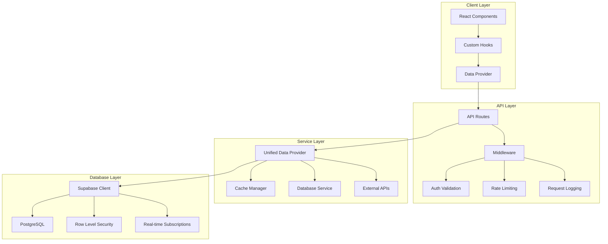

# 🔌 API設計詳細仕様

## 概要
Masa Flash英単語学習アプリケーションのAPI設計詳細仕様書です。Next.js App RouterのAPI Routes、データ取得戦略、エラーハンドリング、認証・認可について詳細に記載しています。

## API アーキテクチャ

### 全体構成図



## API Routes 設計

### 1. 統一データAPI (`/api/data/[type]/route.ts`)

```typescript
// 統一データ取得エンドポイント
import { NextRequest, NextResponse } from 'next/server';
import { createServerClient } from '@/lib/supabase/server';
import { dataProvider } from '@/lib/data-provider';
import { z } from 'zod';

// リクエストスキーマ定義
const DataRequestSchema = z.object({
  type: z.enum(['words', 'categories', 'user-progress', 'quiz-questions']),
  params: z.object({
    category: z.string().optional(),
    userId: z.string().uuid().optional(),
    limit: z.number().min(1).max(100).default(20),
    offset: z.number().min(0).default(0),
    search: z.string().optional(),
    filters: z.record(z.any()).optional()
  }).optional()
});

export async function GET(
  request: NextRequest,
  { params }: { params: { type: string } }
) {
  const startTime = Date.now();
  
  try {
    // リクエスト検証
    const url = new URL(request.url);
    const searchParams = Object.fromEntries(url.searchParams);
    
    const validatedRequest = DataRequestSchema.parse({
      type: params.type,
      params: {
        ...searchParams,
        limit: searchParams.limit ? parseInt(searchParams.limit) : 20,
        offset: searchParams.offset ? parseInt(searchParams.offset) : 0
      }
    });
    
    // 認証チェック（必要に応じて）
    const supabase = createServerClient();
    const { data: { user } } = await supabase.auth.getUser();
    
    if (requiresAuth(validatedRequest.type) && !user) {
      return NextResponse.json(
        { error: 'Unauthorized', code: 'AUTH_REQUIRED' },
        { status: 401 }
      );
    }
    
    // データ取得
    const data = await dataProvider.getData(validatedRequest.type, {
      ...validatedRequest.params,
      userId: user?.id
    });
    
    // レスポンス生成
    const response = NextResponse.json({
      data,
      meta: {
        type: validatedRequest.type,
        count: Array.isArray(data) ? data.length : 1,
        timestamp: new Date().toISOString(),
        responseTime: Date.now() - startTime
      }
    });
    
    // キャッシュヘッダー設定
    const cacheMaxAge = getCacheMaxAge(validatedRequest.type);
    response.headers.set('Cache-Control', `public, max-age=${cacheMaxAge}, s-maxage=${cacheMaxAge}`);
    response.headers.set('CDN-Cache-Control', `public, max-age=${cacheMaxAge * 2}`);
    
    return response;
    
  } catch (error) {
    console.error('API Error:', {
      type: params.type,
      error: error.message,
      stack: error.stack,
      timestamp: new Date().toISOString(),
      responseTime: Date.now() - startTime
    });
    
    if (error instanceof z.ZodError) {
      return NextResponse.json(
        { 
          error: 'Validation Error', 
          code: 'VALIDATION_ERROR',
          details: error.errors 
        },
        { status: 400 }
      );
    }
    
    return NextResponse.json(
      { 
        error: 'Internal Server Error', 
        code: 'INTERNAL_ERROR',
        message: process.env.NODE_ENV === 'development' ? error.message : 'An error occurred'
      },
      { status: 500 }
    );
  }
}

export async function POST(
  request: NextRequest,
  { params }: { params: { type: string } }
) {
  try {
    const body = await request.json();
    
    // 認証必須
    const supabase = createServerClient();
    const { data: { user } } = await supabase.auth.getUser();
    
    if (!user) {
      return NextResponse.json(
        { error: 'Unauthorized', code: 'AUTH_REQUIRED' },
        { status: 401 }
      );
    }
    
    // データ更新/作成
    const result = await dataProvider.updateData(params.type, {
      ...body,
      userId: user.id
    });
    
    // ISR再検証トリガー
    await triggerRevalidation([`/api/data/${params.type}`]);
    
    return NextResponse.json({
      data: result,
      meta: {
        operation: 'update',
        timestamp: new Date().toISOString()
      }
    });
    
  } catch (error) {
    console.error('API POST Error:', error);
    return NextResponse.json(
      { error: 'Internal Server Error', code: 'INTERNAL_ERROR' },
      { status: 500 }
    );
  }
}

// ヘルパー関数
function requiresAuth(type: string): boolean {
  const publicTypes = ['words', 'categories'];
  return !publicTypes.includes(type);
}

function getCacheMaxAge(type: string): number {
  const cacheConfig = {
    'words': 3600,           // 1時間
    'categories': 3600,      // 1時間  
    'user-progress': 300,    // 5分
    'quiz-questions': 900    // 15分
  };
  
  return cacheConfig[type] || 300;
}

async function triggerRevalidation(paths: string[]) {
  if (process.env.REVALIDATION_TOKEN) {
    for (const path of paths) {
      await fetch(`${process.env.NEXT_PUBLIC_BASE_URL}/api/revalidate`, {
        method: 'POST',
        headers: { 'Content-Type': 'application/json' },
        body: JSON.stringify({ 
          token: process.env.REVALIDATION_TOKEN,
          path 
        })
      });
    }
  }
}
```

### 2. ISR再検証API (`/api/revalidate/route.ts`)

```typescript
import { NextRequest, NextResponse } from 'next/server';
import { revalidatePath, revalidateTag } from 'next/cache';

interface RevalidateRequest {
  token: string;
  path?: string;
  tag?: string;
  clearAll?: boolean;
}

export async function POST(request: NextRequest) {
  try {
    const body: RevalidateRequest = await request.json();
    
    // トークン検証
    if (body.token !== process.env.REVALIDATION_TOKEN) {
      return NextResponse.json(
        { error: 'Invalid token', code: 'INVALID_TOKEN' },
        { status: 401 }
      );
    }
    
    // 全キャッシュクリア
    if (body.clearAll) {
      const pathsToRevalidate = [
        '/',
        '/protected',
        '/protected/category/[category]',
        '/api/data/words',
        '/api/data/categories',
        '/api/static-data'
      ];
      
      for (const path of pathsToRevalidate) {
        revalidatePath(path);
      }
      
      return NextResponse.json({
        revalidated: true,
        paths: pathsToRevalidate,
        timestamp: new Date().toISOString()
      });
    }
    
    // パス指定再検証
    if (body.path) {
      revalidatePath(body.path);
      return NextResponse.json({
        revalidated: true,
        path: body.path,
        timestamp: new Date().toISOString()
      });
    }
    
    // タグ指定再検証
    if (body.tag) {
      revalidateTag(body.tag);
      return NextResponse.json({
        revalidated: true,
        tag: body.tag,
        timestamp: new Date().toISOString()
      });
    }
    
    return NextResponse.json(
      { error: 'No revalidation target specified', code: 'NO_TARGET' },
      { status: 400 }
    );
    
  } catch (error) {
    console.error('Revalidation Error:', error);
    return NextResponse.json(
      { error: 'Revalidation failed', code: 'REVALIDATION_ERROR' },
      { status: 500 }
    );
  }
}
```

### 3. ヘルスチェックAPI (`/api/health/route.ts`)

```typescript
import { NextResponse } from 'next/server';
import { createServerClient } from '@/lib/supabase/server';

interface HealthCheck {
  service: string;
  status: 'healthy' | 'unhealthy' | 'degraded';
  responseTime: number;
  details?: any;
}

export async function GET() {
  const startTime = Date.now();
  const checks: HealthCheck[] = [];
  
  // データベース接続チェック
  try {
    const dbStart = Date.now();
    const supabase = createServerClient();
    const { data, error } = await supabase
      .from('words')
      .select('id')
      .limit(1);
    
    checks.push({
      service: 'database',
      status: error ? 'unhealthy' : 'healthy',
      responseTime: Date.now() - dbStart,
      details: error ? { error: error.message } : { recordCount: data?.length || 0 }
    });
  } catch (error) {
    checks.push({
      service: 'database',
      status: 'unhealthy',
      responseTime: Date.now() - startTime,
      details: { error: error.message }
    });
  }
  
  // 認証サービスチェック
  try {
    const authStart = Date.now();
    const supabase = createServerClient();
    const { data: { session } } = await supabase.auth.getSession();
    
    checks.push({
      service: 'auth',
      status: 'healthy',
      responseTime: Date.now() - authStart,
      details: { hasActiveSession: !!session }
    });
  } catch (error) {
    checks.push({
      service: 'auth',
      status: 'unhealthy',
      responseTime: Date.now() - startTime,
      details: { error: error.message }
    });
  }
  
  // キャッシュシステムチェック
  try {
    const cacheStart = Date.now();
    // Next.js キャッシュの簡易チェック
    const response = await fetch(`${process.env.NEXT_PUBLIC_BASE_URL}/api/static-data`, {
      method: 'HEAD'
    });
    
    checks.push({
      service: 'cache',
      status: response.ok ? 'healthy' : 'degraded',
      responseTime: Date.now() - cacheStart,
      details: { 
        cacheHeaders: response.headers.get('cache-control'),
        status: response.status 
      }
    });
  } catch (error) {
    checks.push({
      service: 'cache',
      status: 'degraded',
      responseTime: Date.now() - startTime,
      details: { error: error.message }
    });
  }
  
  // 全体ステータス判定
  const overallStatus = checks.every(check => check.status === 'healthy') 
    ? 'healthy' 
    : checks.some(check => check.status === 'unhealthy') 
    ? 'unhealthy' 
    : 'degraded';
  
  const statusCode = overallStatus === 'healthy' ? 200 : 
                    overallStatus === 'degraded' ? 200 : 503;
  
  return NextResponse.json({
    status: overallStatus,
    timestamp: new Date().toISOString(),
    responseTime: Date.now() - startTime,
    version: process.env.npm_package_version || '1.0.0',
    environment: process.env.NODE_ENV,
    checks
  }, { status: statusCode });
}
```

### 4. 静的データAPI (`/api/static-data/route.ts`)

```typescript
import { NextResponse } from 'next/server';
import { unstable_cache } from 'next/cache';
import { createServerClient } from '@/lib/supabase/server';

// 24時間キャッシュされる静的データ取得
const getCachedStaticData = unstable_cache(
  async () => {
    const supabase = createServerClient();
    
    const [categoriesResult, statsResult] = await Promise.all([
      supabase
        .from('categories')
        .select('*')
        .eq('is_active', true)
        .order('sort_order'),
      
      supabase
        .from('words')
        .select('category, id.count()')
        .group('category')
    ]);
    
    if (categoriesResult.error) throw categoriesResult.error;
    if (statsResult.error) throw statsResult.error;
    
    return {
      categories: categoriesResult.data,
      wordCounts: statsResult.data.reduce((acc, item) => {
        acc[item.category] = item.count;
        return acc;
      }, {} as Record<string, number>),
      totalWords: statsResult.data.reduce((sum, item) => sum + item.count, 0),
      lastUpdated: new Date().toISOString()
    };
  },
  ['static-data'],
  { 
    revalidate: 86400, // 24時間
    tags: ['static-data', 'categories', 'words']
  }
);

export async function GET() {
  try {
    const data = await getCachedStaticData();
    
    const response = NextResponse.json({
      data,
      meta: {
        cached: true,
        timestamp: new Date().toISOString()
      }
    });
    
    // 長期キャッシュヘッダー
    response.headers.set(
      'Cache-Control', 
      'public, max-age=86400, s-maxage=86400, stale-while-revalidate=172800'
    );
    response.headers.set('CDN-Cache-Control', 'public, max-age=172800');
    
    return response;
    
  } catch (error) {
    console.error('Static Data API Error:', error);
    return NextResponse.json(
      { error: 'Failed to fetch static data', code: 'STATIC_DATA_ERROR' },
      { status: 500 }
    );
  }
}
```

## データ取得戦略

### 1. 統一データプロバイダー (`lib/data-provider.ts`)

```typescript
import { createServerClient } from '@/lib/supabase/server';
import { unstable_cache } from 'next/cache';
import type { Word, Category, UserProgress, PageData } from '@/lib/types';

class UnifiedDataProvider {
  private supabase = createServerClient();
  
  // キャッシュ設定
  private readonly CACHE_CONFIG = {
    SHORT: { revalidate: 300 },   // 5分
    MEDIUM: { revalidate: 900 },  // 15分
    LONG: { revalidate: 3600 },   // 1時間
    STATIC: { revalidate: 86400 } // 24時間
  };
  
  // 単語データ取得（カテゴリー別）
  private getCachedWordsByCategory = unstable_cache(
    async (category: string): Promise<Word[]> => {
      const { data, error } = await this.supabase
        .from('words')
        .select('*')
        .eq('category', category)
        .order('frequency_rank', { ascending: true, nullsLast: true });
      
      if (error) throw error;
      return data;
    },
    ['words-by-category'],
    this.CACHE_CONFIG.MEDIUM
  );
  
  // ユーザー進捗取得
  private getCachedUserProgress = unstable_cache(
    async (userId: string, category?: string): Promise<UserProgress[]> => {
      let query = this.supabase
        .from('user_progress')
        .select(`
          *,
          words (
            category,
            word,
            japanese
          )
        `)
        .eq('user_id', userId);
      
      if (category) {
        query = query.eq('words.category', category);
      }
      
      const { data, error } = await query;
      if (error) throw error;
      return data;
    },
    ['user-progress'],
    this.CACHE_CONFIG.SHORT
  );
  
  // カテゴリー一覧取得
  private getCachedCategories = unstable_cache(
    async (): Promise<Category[]> => {
      const { data, error } = await this.supabase
        .from('categories')
        .select('*')
        .eq('is_active', true)
        .order('sort_order');
      
      if (error) throw error;
      return data;
    },
    ['categories'],
    this.CACHE_CONFIG.LONG
  );
  
  // ページデータ統合取得
  async getPageData(
    type: 'category' | 'review' | 'quiz',
    params: {
      category?: string;
      userId?: string;
      limit?: number;
    }
  ): Promise<PageData> {
    const { category, userId, limit = 20 } = params;
    
    try {
      // 並列データ取得
      const [words, categories, userProgress] = await Promise.all([
        category ? this.getCachedWordsByCategory(category) : [],
        this.getCachedCategories(),
        userId ? this.getCachedUserProgress(userId, category) : []
      ]);
      
      // データ統合
      const wordsWithProgress = words.map(word => {
        const progress = userProgress.find(p => p.word_id === word.id);
        return {
          ...word,
          progress: progress || null
        };
      });
      
      return {
        words: wordsWithProgress.slice(0, limit),
        categories,
        userProgress,
        meta: {
          totalWords: words.length,
          category,
          userId,
          timestamp: new Date().toISOString()
        }
      };
      
    } catch (error) {
      console.error('Page Data Error:', error);
      throw new Error(`Failed to fetch page data: ${error.message}`);
    }
  }
  
  // 進捗更新
  async updateUserProgress(
    userId: string,
    wordId: string,
    data: {
      isCorrect: boolean;
      studyMode: 'flashcard' | 'quiz';
      responseTime?: number;
    }
  ): Promise<UserProgress> {
    try {
      // 現在の進捗を取得
      const { data: currentProgress } = await this.supabase
        .from('user_progress')
        .select('*')
        .eq('user_id', userId)
        .eq('word_id', wordId)
        .single();
      
      // 習熟度計算
      const newMasteryLevel = this.calculateMasteryLevel(
        currentProgress,
        data.isCorrect
      );
      
      // 進捗更新
      const { data: updatedProgress, error } = await this.supabase
        .from('user_progress')
        .upsert({
          user_id: userId,
          word_id: wordId,
          mastery_level: newMasteryLevel,
          study_count: (currentProgress?.study_count || 0) + 1,
          correct_count: (currentProgress?.correct_count || 0) + (data.isCorrect ? 1 : 0),
          incorrect_count: (currentProgress?.incorrect_count || 0) + (data.isCorrect ? 0 : 1),
          last_studied: new Date().toISOString(),
          updated_at: new Date().toISOString()
        })
        .select()
        .single();
      
      if (error) throw error;
      
      // キャッシュ無効化
      this.invalidateUserProgressCache(userId);
      
      return updatedProgress;
      
    } catch (error) {
      console.error('Progress Update Error:', error);
      throw error;
    }
  }
  
  // 習熟度計算（SM-2アルゴリズム簡易版）
  private calculateMasteryLevel(
    currentProgress: UserProgress | null,
    isCorrect: boolean
  ): number {
    const current = currentProgress?.mastery_level || 0;
    
    if (isCorrect) {
      return Math.min(1.0, current + 0.1);
    } else {
      return Math.max(0.0, current - 0.2);
    }
  }
  
  // キャッシュ無効化
  private async invalidateUserProgressCache(userId: string) {
    // Next.js 15のキャッシュタグシステムを使用
    await fetch('/api/revalidate', {
      method: 'POST',
      headers: { 'Content-Type': 'application/json' },
      body: JSON.stringify({
        token: process.env.REVALIDATION_TOKEN,
        tag: `user-progress-${userId}`
      })
    });
  }
}

// シングルトンインスタンス
export const dataProvider = new UnifiedDataProvider();
```

### 2. カスタムフック (`lib/hooks/use-page-data.ts`)

```typescript
'use client';

import { useState, useEffect } from 'react';
import { useAuth } from '@/lib/hooks/use-auth';
import type { PageData } from '@/lib/types';

interface UsePageDataOptions {
  type: 'category' | 'review' | 'quiz';
  category?: string;
  limit?: number;
  prefetchedData?: PageData;
  enabled?: boolean;
}

interface UsePageDataReturn {
  data: PageData | null;
  loading: boolean;
  error: Error | null;
  refetch: () => Promise<void>;
}

export function usePageData(options: UsePageDataOptions): UsePageDataReturn {
  const { 
    type, 
    category, 
    limit = 20, 
    prefetchedData, 
    enabled = true 
  } = options;
  
  const { user } = useAuth();
  const [data, setData] = useState<PageData | null>(prefetchedData || null);
  const [loading, setLoading] = useState(!prefetchedData);
  const [error, setError] = useState<Error | null>(null);
  
  const fetchData = async () => {
    if (!enabled) return;
    
    try {
      setLoading(true);
      setError(null);
      
      const params = new URLSearchParams({
        category: category || '',
        userId: user?.id || '',
        limit: limit.toString()
      });
      
      const response = await fetch(`/api/data/${type}?${params}`);
      
      if (!response.ok) {
        throw new Error(`HTTP ${response.status}: ${response.statusText}`);
      }
      
      const result = await response.json();
      setData(result.data);
      
    } catch (err) {
      console.error('Data fetch error:', err);
      setError(err instanceof Error ? err : new Error('Unknown error'));
    } finally {
      setLoading(false);
    }
  };
  
  useEffect(() => {
    if (!prefetchedData) {
      fetchData();
    }
  }, [type, category, user?.id, limit, enabled]);
  
  return {
    data,
    loading,
    error,
    refetch: fetchData
  };
}
```

## エラーハンドリング

### 1. API エラーレスポンス標準化

```typescript
// lib/api-errors.ts
export class APIError extends Error {
  constructor(
    message: string,
    public code: string,
    public status: number,
    public details?: any
  ) {
    super(message);
    this.name = 'APIError';
  }
}

export const API_ERRORS = {
  VALIDATION_ERROR: (details: any) => new APIError(
    'Validation failed',
    'VALIDATION_ERROR',
    400,
    details
  ),
  
  AUTH_REQUIRED: () => new APIError(
    'Authentication required',
    'AUTH_REQUIRED',
    401
  ),
  
  FORBIDDEN: () => new APIError(
    'Access forbidden',
    'FORBIDDEN',
    403
  ),
  
  NOT_FOUND: (resource: string) => new APIError(
    `${resource} not found`,
    'NOT_FOUND',
    404,
    { resource }
  ),
  
  RATE_LIMITED: () => new APIError(
    'Rate limit exceeded',
    'RATE_LIMITED',
    429
  ),
  
  INTERNAL_ERROR: (message?: string) => new APIError(
    message || 'Internal server error',
    'INTERNAL_ERROR',
    500
  )
};

export function handleAPIError(error: unknown): NextResponse {
  if (error instanceof APIError) {
    return NextResponse.json(
      {
        error: error.message,
        code: error.code,
        details: error.details
      },
      { status: error.status }
    );
  }
  
  console.error('Unhandled API Error:', error);
  return NextResponse.json(
    { error: 'Internal Server Error', code: 'INTERNAL_ERROR' },
    { status: 500 }
  );
}
```

### 2. クライアントサイドエラーハンドリング

```typescript
// lib/api-client.ts
class APIClient {
  private baseURL: string;
  
  constructor(baseURL: string = '/api') {
    this.baseURL = baseURL;
  }
  
  async request<T>(
    endpoint: string,
    options: RequestInit = {}
  ): Promise<T> {
    const url = `${this.baseURL}${endpoint}`;
    
    try {
      const response = await fetch(url, {
        headers: {
          'Content-Type': 'application/json',
          ...options.headers
        },
        ...options
      });
      
      const data = await response.json();
      
      if (!response.ok) {
        throw new APIError(
          data.error || 'Request failed',
          data.code || 'REQUEST_FAILED',
          response.status,
          data.details
        );
      }
      
      return data;
      
    } catch (error) {
      if (error instanceof APIError) {
        throw error;
      }
      
      // ネットワークエラーなど
      throw new APIError(
        'Network error occurred',
        'NETWORK_ERROR',
        0,
        { originalError: error.message }
      );
    }
  }
  
  // GET リクエスト
  async get<T>(endpoint: string, params?: Record<string, any>): Promise<T> {
    const url = params 
      ? `${endpoint}?${new URLSearchParams(params)}`
      : endpoint;
    
    return this.request<T>(url, { method: 'GET' });
  }
  
  // POST リクエスト
  async post<T>(endpoint: string, data?: any): Promise<T> {
    return this.request<T>(endpoint, {
      method: 'POST',
      body: data ? JSON.stringify(data) : undefined
    });
  }
  
  // PUT リクエスト
  async put<T>(endpoint: string, data?: any): Promise<T> {
    return this.request<T>(endpoint, {
      method: 'PUT',
      body: data ? JSON.stringify(data) : undefined
    });
  }
  
  // DELETE リクエスト
  async delete<T>(endpoint: string): Promise<T> {
    return this.request<T>(endpoint, { method: 'DELETE' });
  }
}

export const apiClient = new APIClient();
```

## 認証・認可

### 1. ミドルウェア認証 (`middleware.ts`)

```typescript
import { NextResponse, type NextRequest } from 'next/server'
import { createServerClient } from '@supabase/ssr'

export async function middleware(request: NextRequest) {
  const pathname = request.nextUrl.pathname
  const cookieNames = request.cookies.getAll().map((c) => c.name)
  const hasSupabaseSessionCookie = cookieNames.some((n) =>
    n.includes('sb-') || n.includes('supabase-auth-token')
  )

  if (pathname === '/landing') {
    return NextResponse.next({ request })
  }

  if (pathname === '/') {
    const url = request.nextUrl.clone()
    url.pathname = hasSupabaseSessionCookie ? '/dashboard' : '/landing'
    return NextResponse.redirect(url)
  }

  let supabaseResponse = NextResponse.next({ request })

  const supabase = createServerClient(
    process.env.NEXT_PUBLIC_SUPABASE_URL!,
    process.env.NEXT_PUBLIC_SUPABASE_ANON_KEY!,
    {
      cookies: {
        getAll() {
          return request.cookies.getAll()
        },
        setAll(cookiesToSet) {
          cookiesToSet.forEach(({ name, value }) => request.cookies.set(name, value))
          supabaseResponse = NextResponse.next({ request })
          cookiesToSet.forEach(({ name, value, options }) =>
            supabaseResponse.cookies.set(name, value, options)
          )
        },
      },
    }
  )

  let user: { email?: string } | null = null
  if (hasSupabaseSessionCookie) {
    const { data } = await supabase.auth.getUser()
    user = data?.user ?? null
  }

  const isAPIRoute = request.nextUrl.pathname.startsWith('/api')
  const isAdminPath = request.nextUrl.pathname.startsWith('/admin')

  if (!user && request.nextUrl.pathname.startsWith('/dashboard')) {
    const url = request.nextUrl.clone()
    url.pathname = '/landing'
    return NextResponse.redirect(url)
  }

  if (isAdminPath && !user) {
    const url = request.nextUrl.clone()
    url.pathname = '/landing'
    return NextResponse.redirect(url)
  }

  if (user && request.nextUrl.pathname.startsWith('/auth')) {
    const url = request.nextUrl.clone()
    url.pathname = '/dashboard'
    return NextResponse.redirect(url)
  }

  return supabaseResponse
}

export const config = {
  matcher: [
    '/((?!_next/static|_next/image|favicon.ico|manifest.json|landing|landing/.*|.*\\.(?:svg|png|jpg|jpeg|gif|webp|ico|woff|woff2|ttf|eot)$).*)'
  ],
}
```

### 2. RLS（Row Level Security）ポリシー

```sql
-- ユーザー進捗データの保護
CREATE POLICY "Users can view own progress" ON user_progress
  FOR SELECT USING (auth.uid() = user_id);

CREATE POLICY "Users can insert own progress" ON user_progress
  FOR INSERT WITH CHECK (auth.uid() = user_id);

CREATE POLICY "Users can update own progress" ON user_progress
  FOR UPDATE USING (auth.uid() = user_id);

-- 学習セッションデータの保護
CREATE POLICY "Users can view own sessions" ON study_sessions
  FOR SELECT USING (auth.uid() = user_id);

CREATE POLICY "Users can insert own sessions" ON study_sessions
  FOR INSERT WITH CHECK (auth.uid() = user_id);

-- 管理者権限の実装
CREATE POLICY "Admins can manage all data" ON words
  FOR ALL USING (
    EXISTS (
      SELECT 1 FROM auth.users 
      WHERE auth.uid() = id 
      AND raw_user_meta_data->>'role' = 'admin'
    )
  );
```

## レート制限

### 1. IP ベースレート制限

```typescript
// lib/rate-limit.ts
import { NextRequest } from 'next/server';

interface RateLimitStore {
  [key: string]: {
    count: number;
    resetTime: number;
  };
}

class RateLimiter {
  private store: RateLimitStore = {};
  private readonly windowMs: number;
  private readonly maxRequests: number;
  
  constructor(windowMs: number = 60000, maxRequests: number = 100) {
    this.windowMs = windowMs;
    this.maxRequests = maxRequests;
  }
  
  check(identifier: string): { allowed: boolean; remaining: number; resetTime: number } {
    const now = Date.now();
    const record = this.store[identifier];
    
    if (!record || now > record.resetTime) {
      this.store[identifier] = {
        count: 1,
        resetTime: now + this.windowMs
      };
      
      return {
        allowed: true,
        remaining: this.maxRequests - 1,
        resetTime: now + this.windowMs
      };
    }
    
    if (record.count >= this.maxRequests) {
      return {
        allowed: false,
        remaining: 0,
        resetTime: record.resetTime
      };
    }
    
    record.count++;
    
    return {
      allowed: true,
      remaining: this.maxRequests - record.count,
      resetTime: record.resetTime
    };
  }
}

export const rateLimiter = new RateLimiter();

export function getRateLimitHeaders(result: ReturnType<RateLimiter['check']>) {
  return {
    'X-RateLimit-Limit': '100',
    'X-RateLimit-Remaining': result.remaining.toString(),
    'X-RateLimit-Reset': Math.ceil(result.resetTime / 1000).toString()
  };
}

export function getClientIP(request: NextRequest): string {
  return request.ip || 
         request.headers.get('x-forwarded-for')?.split(',')[0] || 
         request.headers.get('x-real-ip') || 
         'unknown';
}
```

## パフォーマンス監視

### 1. API レスポンス時間監視

```typescript
// lib/monitoring.ts
export class APIMonitor {
  static startTimer() {
    return Date.now();
  }
  
  static endTimer(startTime: number, endpoint: string, status: number) {
    const duration = Date.now() - startTime;
    
    // メトリクス収集
    console.log('API Metrics:', {
      endpoint,
      status,
      duration,
      timestamp: new Date().toISOString()
    });
    
    // 閾値チェック
    if (duration > 5000) { // 5秒以上
      console.warn('Slow API Response:', {
        endpoint,
        duration,
        status
      });
    }
    
    return duration;
  }
}

// 使用例
export async function GET(request: NextRequest) {
  const startTime = APIMonitor.startTimer();
  
  try {
    // API処理
    const result = await processRequest();
    
    APIMonitor.endTimer(startTime, request.url, 200);
    return NextResponse.json(result);
    
  } catch (error) {
    APIMonitor.endTimer(startTime, request.url, 500);
    throw error;
  }
}
```

---

この仕様書は、API設計の詳細と実装指針を包括的にカバーしています。スケーラビリティ、セキュリティ、パフォーマンスを重視した設計となっています。 