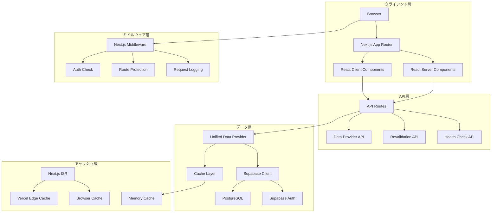
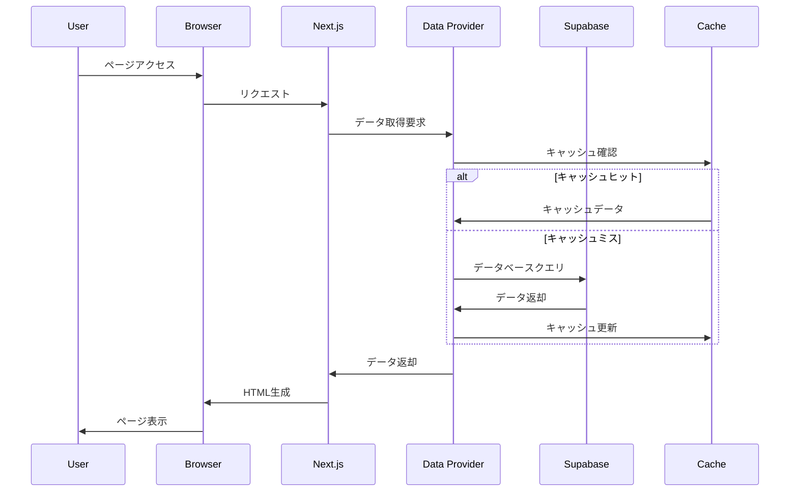
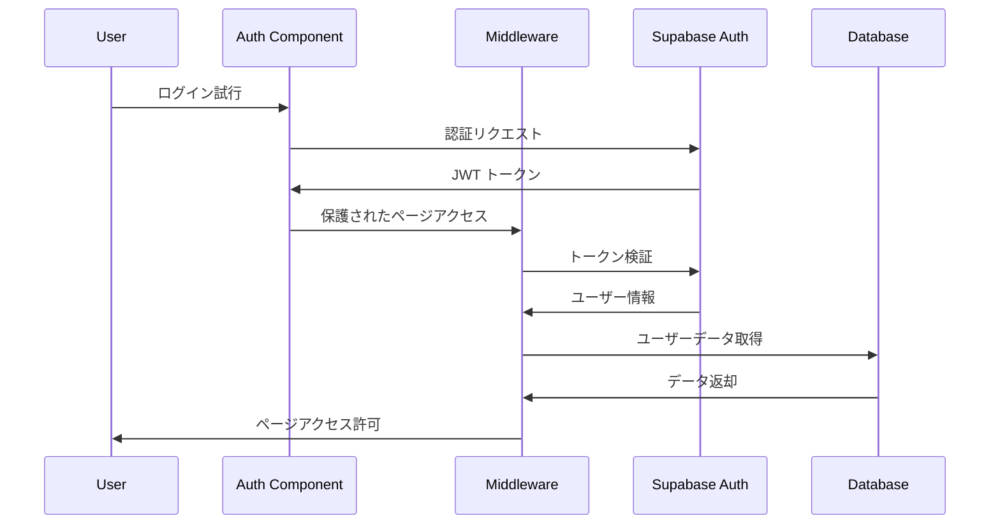

# 🏗️ システムアーキテクチャ詳細仕様

## 概要
Masa Flash英単語学習アプリケーションの詳細なアーキテクチャ設計書です。システム全体の構成、データフロー、技術的判断の根拠を詳細に記載しています。

## システム構成

### 全体アーキテクチャ図



### レイヤー別責務

#### 1. プレゼンテーション層
- **Server Components**: データ取得、初期レンダリング
- **Client Components**: ユーザーインタラクション、状態管理
- **Pages**: ルーティング、レイアウト管理

#### 2. ビジネスロジック層
- **Data Provider**: データアクセスの抽象化
- **Hooks**: 再利用可能なロジック
- **Utils**: 共通ユーティリティ関数

#### 3. データアクセス層
- **Supabase Client**: データベース操作
- **Cache Management**: キャッシュ戦略
- **Type Definitions**: データ型定義

## データフロー

### 1. ページ読み込みフロー



### 2. 認証フロー



## 技術選定の根拠

### Next.js 15 App Router
**選定理由:**
- Server Components による初期レンダリング高速化
- ISR による動的キャッシュ戦略
- ファイルベースルーティングの開発効率
- Vercel との最適化された統合

**代替案検討:**
- Remix: SSR特化だがISRサポート不足
- Vite + React: SPA構成でSEO課題
- Gatsby: 静的サイト特化で動的コンテンツ制約

### Supabase
**選定理由:**
- Row Level Security による細かな権限制御
- リアルタイム機能（将来の拡張性）
- PostgreSQL の豊富な機能
- 認証システムの統合

**代替案検討:**
- Firebase: NoSQLで複雑なクエリ制約
- PlanetScale: MySQL制約、RLS未対応
- 自前構築: 開発・運用コスト高

### TypeScript
**選定理由:**
- 型安全性による開発効率向上
- IDE支援による開発体験向上
- リファクタリング安全性
- チーム開発での品質担保

## パフォーマンス設計

### キャッシュ戦略

#### 1. 多層キャッシュ構成
```typescript
// キャッシュレベル定義
const CACHE_LEVELS = {
  L1_BROWSER: { maxAge: 300 },      // 5分
  L2_CDN: { maxAge: 900 },          // 15分  
  L3_ISR: { revalidate: 3600 },     // 1時間
  L4_DATABASE: { ttl: 86400 }       // 24時間
} as const;
```

#### 2. データ別キャッシュ戦略
- **静的データ**: 24時間キャッシュ（カテゴリー、単語マスター）
- **ユーザーデータ**: 5分キャッシュ（進捗、お気に入り）
- **セッションデータ**: キャッシュなし（リアルタイム性重視）

### データベース最適化

#### 1. インデックス設計
```sql
-- 複合インデックス: カテゴリー別単語検索
CREATE INDEX idx_words_category_id ON words(category, id);

-- 部分インデックス: アクティブユーザー進捗
CREATE INDEX idx_user_progress_active 
ON user_progress(user_id, word_id) 
WHERE last_studied > NOW() - INTERVAL '30 days';

-- 関数インデックス: 習熟度計算
CREATE INDEX idx_mastery_calculated 
ON user_progress((correct_count::float / NULLIF(study_count, 0)));
```

#### 2. クエリ最適化
```typescript
// バッチクエリによるN+1問題回避
const getWordsWithProgress = async (userId: string, category: string) => {
  return await supabase
    .from('words')
    .select(`
      *,
      user_progress!left(
        mastery_level,
        study_count,
        is_favorite
      )
    `)
    .eq('category', category)
    .eq('user_progress.user_id', userId);
};
```

## セキュリティ設計

### 認証・認可アーキテクチャ

#### 1. 多層防御戦略
```typescript
// レイヤー1: ミドルウェアでの認証チェック
export async function middleware(request: NextRequest) {
  const { data: { user } } = await supabase.auth.getUser();
  if (!user && isProtectedRoute(request.nextUrl.pathname)) {
    return NextResponse.redirect(new URL('/auth/login', request.url));
  }
}

// レイヤー2: ページレベル認証
export default async function ProtectedPage() {
  const { data: { user } } = await supabase.auth.getUser();
  if (!user) notFound();
  // ...
}

// レイヤー3: データベースRLS
CREATE POLICY "users_own_progress" ON user_progress
  FOR ALL USING (auth.uid() = user_id);
```

#### 2. データ保護戦略
- **暗号化**: JWTトークン、セッションデータ
- **検証**: CSRF保護、入力値サニタイズ
- **監査**: アクセスログ、操作履歴

### セキュリティヘッダー
```typescript
// セキュリティヘッダー設定
const securityHeaders = [
  { key: 'X-DNS-Prefetch-Control', value: 'on' },
  { key: 'Strict-Transport-Security', value: 'max-age=63072000' },
  { key: 'X-Frame-Options', value: 'SAMEORIGIN' },
  { key: 'X-Content-Type-Options', value: 'nosniff' },
  { key: 'Referrer-Policy', value: 'origin-when-cross-origin' },
  { key: 'Permissions-Policy', value: 'camera=(), microphone=(), geolocation=()' }
];
```

## スケーラビリティ設計

### 水平スケーリング対応

#### 1. ステートレス設計
- サーバーサイドでのセッション状態保持なし
- JWT による自己完結型認証
- データベース依存の状態管理

#### 2. キャッシュ分散
```typescript
// Redis クラスター対応（将来拡張）
const cacheConfig = {
  cluster: {
    nodes: [
      { host: 'cache-1', port: 6379 },
      { host: 'cache-2', port: 6379 },
      { host: 'cache-3', port: 6379 }
    ],
    options: {
      redisOptions: { password: process.env.REDIS_PASSWORD }
    }
  }
};
```

### データベーススケーリング

#### 1. 読み取りレプリカ対応
```typescript
// 読み取り専用クエリの分離
const readOnlySupabase = createClient(
  process.env.SUPABASE_READ_REPLICA_URL!,
  process.env.SUPABASE_ANON_KEY!
);

const getStaticData = () => readOnlySupabase.from('words').select('*');
const getUserProgress = () => supabase.from('user_progress').select('*');
```

#### 2. パーティショニング戦略
```sql
-- 日付ベースパーティショニング（学習履歴）
CREATE TABLE study_sessions (
  id UUID DEFAULT gen_random_uuid(),
  user_id UUID NOT NULL,
  created_at TIMESTAMP WITH TIME ZONE DEFAULT NOW(),
  -- ...
) PARTITION BY RANGE (created_at);

-- 月次パーティション作成
CREATE TABLE study_sessions_2024_01 PARTITION OF study_sessions
FOR VALUES FROM ('2024-01-01') TO ('2024-02-01');
```

## 監視・観測可能性

### メトリクス収集

#### 1. アプリケーションメトリクス
```typescript
// カスタムメトリクス定義
interface AppMetrics {
  userSessions: {
    active: number;
    duration: number;
    studyMode: 'flashcard' | 'quiz';
  };
  performance: {
    pageLoadTime: number;
    apiResponseTime: number;
    cacheHitRate: number;
  };
  business: {
    wordsStudied: number;
    quizAccuracy: number;
    retentionRate: number;
  };
}
```

#### 2. エラー追跡
```typescript
// 構造化エラーログ
class ErrorTracker {
  static log(error: Error, context: Record<string, any>) {
    const errorData = {
      message: error.message,
      stack: error.stack,
      timestamp: new Date().toISOString(),
      context,
      userId: context.userId || 'anonymous',
      sessionId: context.sessionId,
      userAgent: context.userAgent
    };
    
    console.error('Application Error:', errorData);
    // 外部監視サービスに送信
  }
}
```

### ヘルスチェック設計
```typescript
// 多層ヘルスチェック
export async function GET() {
  const checks = await Promise.allSettled([
    checkDatabase(),
    checkSupabaseAuth(),
    checkCacheHealth(),
    checkExternalServices()
  ]);
  
  return NextResponse.json({
    status: checks.every(c => c.status === 'fulfilled') ? 'healthy' : 'degraded',
    checks: checks.map((check, index) => ({
      service: ['database', 'auth', 'cache', 'external'][index],
      status: check.status,
      responseTime: check.status === 'fulfilled' ? check.value.responseTime : null
    })),
    timestamp: new Date().toISOString()
  });
}
```

## 災害復旧・事業継続

### バックアップ戦略

#### 1. データベースバックアップ
- **頻度**: 日次フルバックアップ、1時間毎差分バックアップ
- **保持期間**: 30日間
- **検証**: 週次リストアテスト

#### 2. アプリケーションバックアップ
```bash
# 設定バックアップスクリプト
#!/bin/bash
DATE=$(date +%Y%m%d_%H%M%S)
BACKUP_DIR="./backups/$DATE"

# 環境変数バックアップ
vercel env pull "$BACKUP_DIR/.env.backup"

# データベーススキーマバックアップ
pg_dump --schema-only $DATABASE_URL > "$BACKUP_DIR/schema.sql"

# 設定ファイルバックアップ
cp next.config.ts tailwind.config.ts "$BACKUP_DIR/"
```

### 障害対応手順

#### 1. 障害レベル定義
- **Level 1**: サービス完全停止（RTO: 15分、RPO: 5分）
- **Level 2**: 機能部分停止（RTO: 1時間、RPO: 15分）
- **Level 3**: パフォーマンス劣化（RTO: 4時間、RPO: 1時間）

#### 2. 自動復旧機能
```typescript
// 自動フェイルオーバー
const createResilientSupabaseClient = () => {
  const primaryClient = createClient(PRIMARY_URL, ANON_KEY);
  const backupClient = createClient(BACKUP_URL, ANON_KEY);
  
  return {
    async query(sql: string) {
      try {
        return await primaryClient.rpc(sql);
      } catch (error) {
        console.warn('Primary database failed, switching to backup');
        return await backupClient.rpc(sql);
      }
    }
  };
};
```

## 将来拡張性

### アーキテクチャ進化計画

#### Phase 1: 現行システム最適化
- ISRキャッシュ戦略の精密化
- データベースクエリ最適化
- セキュリティ強化

#### Phase 2: 機能拡張
- PWA対応（オフライン機能）
- リアルタイム学習セッション
- AI推薦システム統合

#### Phase 3: スケール対応
- マイクロサービス分割
- Kubernetes基盤移行
- グローバル展開対応

### 技術負債管理

#### 1. 定期的なリファクタリング
```typescript
// レガシーコード識別
const LEGACY_MARKERS = [
  'TODO: リファクタリング必要',
  'HACK: 一時的な実装',
  'FIXME: 本格対応必要'
];
```

#### 2. 依存関係管理
```json
{
  "scripts": {
    "audit": "npm audit && npm outdated",
    "update-deps": "npm update && npm audit fix",
    "security-check": "npm audit --audit-level high"
  }
}
```

---

この設計書は、システムの技術的詳細と将来の拡張性を考慮した包括的なアーキテクチャ仕様です。開発チームの技術的判断の指針として活用してください。 