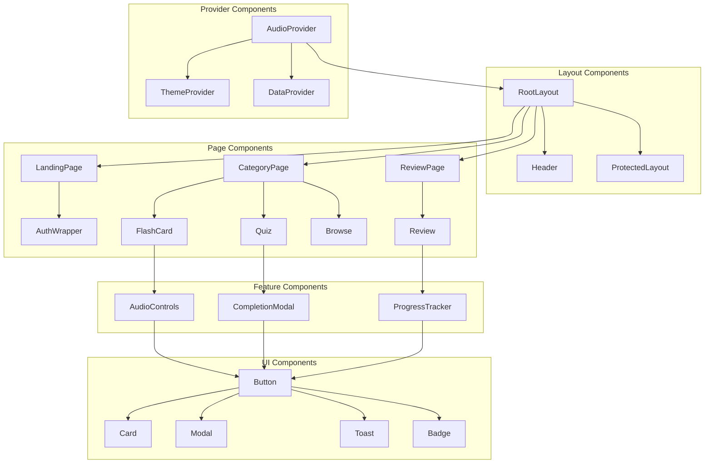

# 🧩 コンポーネント設計詳細仕様

## 概要
Masa Flash英単語学習アプリケーションのReactコンポーネント設計詳細仕様書です。各コンポーネントの責務、Props定義、状態管理、パフォーマンス最適化について詳細に記載しています。

## コンポーネントアーキテクチャ

### 全体構成図



## コンポーネント分類

### 1. Server Components（サーバーサイド）
- データ取得とSSR担当
- クライアントサイドJavaScript不要
- SEO最適化対応

### 2. Client Components（クライアントサイド）
- ユーザーインタラクション担当
- 状態管理とイベントハンドリング
- `'use client'`ディレクティブ必須

### 3. Hybrid Components（ハイブリッド）
- Server/Client両方で利用可能
- 条件付きレンダリング対応

## 詳細コンポーネント仕様

### Layout Components

#### 1. RootLayout (`app/layout.tsx`)

```typescript
// Server Component
interface RootLayoutProps {
  children: React.ReactNode;
}

export default async function RootLayout({ children }: RootLayoutProps) {
  // サーバーサイドでのユーザー認証状態確認
  const { data: { user } } = await createServerClient().auth.getUser();
  
  return (
    <html lang="ja" suppressHydrationWarning>
      <body className={cn("min-h-screen bg-background font-sans antialiased", fontSans.variable)}>
        <ThemeProvider attribute="class" defaultTheme="system" enableSystem>
          <AudioProvider>
            <div className="relative flex min-h-screen flex-col">
              <Header user={user} />
              <main className="flex-1">{children}</main>
            </div>
            <Toaster />
          </AudioProvider>
        </ThemeProvider>
      </body>
    </html>
  );
}

// パフォーマンス最適化
export const metadata: Metadata = {
  title: {
    default: "Masa Flash - 英単語学習アプリ",
    template: "%s | Masa Flash"
  },
  description: "効率的な英単語学習のための次世代プラットフォーム",
  keywords: ["英語学習", "単語学習", "フラッシュカード", "クイズ"],
  authors: [{ name: "Masa Flash Team" }],
  creator: "Masa Flash",
  openGraph: {
    type: "website",
    locale: "ja_JP",
    url: "https://masa-flash.vercel.app",
    siteName: "Masa Flash",
  },
  twitter: {
    card: "summary_large_image",
    title: "Masa Flash - 英単語学習アプリ",
    description: "効率的な英単語学習のための次世代プラットフォーム",
  },
  robots: {
    index: true,
    follow: true,
    googleBot: {
      index: true,
      follow: true,
      'max-video-preview': -1,
      'max-image-preview': 'large',
      'max-snippet': -1,
    },
  },
};

export const viewport: Viewport = {
  themeColor: [
    { media: "(prefers-color-scheme: light)", color: "white" },
    { media: "(prefers-color-scheme: dark)", color: "black" },
  ],
  width: 'device-width',
  initialScale: 1,
  maximumScale: 1,
};
```

#### 2. Header Component (`components/header.tsx`)

```typescript
// Client Component
'use client';

interface HeaderProps {
  user: User | null;
}

interface NavigationItem {
  name: string;
  href: string;
  icon: React.ComponentType<{ className?: string }>;
  requireAuth: boolean;
}

const navigation: NavigationItem[] = [
  { name: 'ホーム', href: '/protected', icon: Home, requireAuth: true },
  { name: '復習', href: '/protected/review', icon: BookOpen, requireAuth: true },
  { name: 'ランディング', href: '/landing', icon: Sparkles, requireAuth: false },
];

export function Header({ user }: HeaderProps) {
  const [isMenuOpen, setIsMenuOpen] = useState(false);
  const pathname = usePathname();
  
  // メニュー項目のフィルタリング
  const visibleNavigation = navigation.filter(item => 
    !item.requireAuth || user
  );
  
  return (
    <header className="sticky top-0 z-50 w-full border-b bg-background/95 backdrop-blur supports-[backdrop-filter]:bg-background/60">
      <div className="container flex h-14 items-center">
        <div className="mr-4 hidden md:flex">
          <Link href="/" className="mr-6 flex items-center space-x-2">
            <GraduationCap className="h-6 w-6" />
            <span className="hidden font-bold sm:inline-block">
              Masa Flash
            </span>
          </Link>
          <nav className="flex items-center space-x-6 text-sm font-medium">
            {visibleNavigation.map((item) => (
              <Link
                key={item.name}
                href={item.href}
                className={cn(
                  "transition-colors hover:text-foreground/80",
                  pathname === item.href ? "text-foreground" : "text-foreground/60"
                )}
              >
                <span className="flex items-center space-x-2">
                  <item.icon className="h-4 w-4" />
                  <span>{item.name}</span>
                </span>
              </Link>
            ))}
          </nav>
        </div>
        
        {/* モバイルメニュー */}
        <Sheet open={isMenuOpen} onOpenChange={setIsMenuOpen}>
          <SheetTrigger asChild className="md:hidden">
            <Button variant="ghost" size="sm" className="mr-2">
              <Menu className="h-5 w-5" />
              <span className="sr-only">メニューを開く</span>
            </Button>
          </SheetTrigger>
          <SheetContent side="left" className="w-80">
            <MobileNav navigation={visibleNavigation} onNavigate={() => setIsMenuOpen(false)} />
          </SheetContent>
        </Sheet>
        
        <div className="flex flex-1 items-center justify-between space-x-2 md:justify-end">
          <div className="w-full flex-1 md:w-auto md:flex-none">
            <Link href="/" className="flex items-center space-x-2 md:hidden">
              <GraduationCap className="h-6 w-6" />
              <span className="font-bold">Masa Flash</span>
            </Link>
          </div>
          <nav className="flex items-center space-x-2">
            <ThemeSwitcher />
            <AudioControls />
            {user ? <LogoutButton /> : <AuthButton />}
          </nav>
        </div>
      </div>
    </header>
  );
}

// パフォーマンス最適化
export default memo(Header);
```

### Feature Components

#### 3. FlashCard Component (`components/flashcard.tsx`)

```typescript
// Client Component
'use client';

interface FlashCardProps {
  words: Word[];
  onComplete: () => void;
  onAddToReview: (wordId: string) => void;
  category: string;
  prefetchedProgress?: UserProgress[];
}

interface FlashCardState {
  currentIndex: number;
  isFlipped: boolean;
  showExample: boolean;
  completedWords: Set<string>;
  reviewWords: Set<string>;
}

export function FlashCard({ 
  words, 
  onComplete, 
  onAddToReview, 
  category,
  prefetchedProgress = []
}: FlashCardProps) {
  const [state, setState] = useState<FlashCardState>({
    currentIndex: 0,
    isFlipped: false,
    showExample: false,
    completedWords: new Set(),
    reviewWords: new Set()
  });
  
  const { speak, isEnabled: audioEnabled } = useAudioStore();
  const [updateProgress] = useUpdateProgressMutation();
  
  // 現在の単語
  const currentWord = words[state.currentIndex];
  const isLastWord = state.currentIndex === words.length - 1;
  
  // 進捗データの統合
  const wordProgress = prefetchedProgress.find(p => p.word_id === currentWord?.id);
  const masteryLevel = wordProgress?.mastery_level || 0;
  
  // カードをフリップ
  const handleFlip = useCallback(() => {
    setState(prev => ({ ...prev, isFlipped: !prev.isFlipped }));
    
    // 音声再生
    if (audioEnabled && currentWord && !state.isFlipped) {
      speak(currentWord.word);
    }
  }, [audioEnabled, currentWord, speak, state.isFlipped]);
  
  // 例文表示切り替え
  const handleToggleExample = useCallback(() => {
    setState(prev => ({ ...prev, showExample: !prev.showExample }));
  }, []);
  
  // 習熟度評価
  const handleMasteryEvaluation = useCallback(async (isCorrect: boolean) => {
    if (!currentWord) return;
    
    try {
      await updateProgress({
        wordId: currentWord.id,
        isCorrect,
        studyMode: 'flashcard'
      });
      
      setState(prev => ({
        ...prev,
        completedWords: new Set([...prev.completedWords, currentWord.id])
      }));
      
      // 次のカードへ
      if (isLastWord) {
        onComplete();
      } else {
        setState(prev => ({
          ...prev,
          currentIndex: prev.currentIndex + 1,
          isFlipped: false,
          showExample: false
        }));
      }
    } catch (error) {
      console.error('進捗更新エラー:', error);
      toast.error('進捗の保存に失敗しました');
    }
  }, [currentWord, updateProgress, isLastWord, onComplete]);
  
  // 復習リストに追加
  const handleAddToReview = useCallback(() => {
    if (!currentWord) return;
    
    setState(prev => ({
      ...prev,
      reviewWords: new Set([...prev.reviewWords, currentWord.id])
    }));
    
    onAddToReview(currentWord.id);
    toast.success('復習リストに追加しました');
  }, [currentWord, onAddToReview]);
  
  // キーボードショートカット
  useEffect(() => {
    const handleKeyPress = (event: KeyboardEvent) => {
      switch (event.key) {
        case ' ':
          event.preventDefault();
          handleFlip();
          break;
        case 'e':
          event.preventDefault();
          handleToggleExample();
          break;
        case '1':
          event.preventDefault();
          handleMasteryEvaluation(false);
          break;
        case '2':
          event.preventDefault();
          handleMasteryEvaluation(true);
          break;
        case 'r':
          event.preventDefault();
          handleAddToReview();
          break;
      }
    };
    
    window.addEventListener('keydown', handleKeyPress);
    return () => window.removeEventListener('keydown', handleKeyPress);
  }, [handleFlip, handleToggleExample, handleMasteryEvaluation, handleAddToReview]);
  
  if (!currentWord) {
    return <div>単語データが見つかりません</div>;
  }
  
  return (
    <div className="flex flex-col items-center space-y-6 p-6">
      {/* 進捗インジケーター */}
      <div className="w-full max-w-md">
        <div className="flex justify-between text-sm text-muted-foreground mb-2">
          <span>{state.currentIndex + 1} / {words.length}</span>
          <span>{category}</span>
        </div>
        <Progress value={(state.currentIndex / words.length) * 100} className="h-2" />
      </div>
      
      {/* フラッシュカード */}
      <Card 
        className={cn(
          "w-full max-w-md h-96 cursor-pointer transition-all duration-300 transform hover:scale-105",
          state.isFlipped && "bg-muted"
        )}
        onClick={handleFlip}
      >
        <CardContent className="flex flex-col items-center justify-center h-full p-8">
          <AnimatePresence mode="wait">
            {!state.isFlipped ? (
              <motion.div
                key="front"
                initial={{ rotateY: 0 }}
                animate={{ rotateY: 0 }}
                exit={{ rotateY: 90 }}
                transition={{ duration: 0.3 }}
                className="text-center"
              >
                <h2 className="text-4xl font-bold mb-4">{currentWord.word}</h2>
                {currentWord.phonetic && (
                  <p className="text-lg text-muted-foreground mb-4">
                    /{currentWord.phonetic}/
                  </p>
                )}
                <Badge variant="outline" className="mb-4">
                  習熟度: {Math.round(masteryLevel * 100)}%
                </Badge>
              </motion.div>
            ) : (
              <motion.div
                key="back"
                initial={{ rotateY: -90 }}
                animate={{ rotateY: 0 }}
                exit={{ rotateY: -90 }}
                transition={{ duration: 0.3 }}
                className="text-center w-full"
              >
                <h3 className="text-2xl font-semibold mb-4">{currentWord.japanese}</h3>
                
                {state.showExample && (
                  <div className="space-y-3 text-left">
                    <div className="border-l-4 border-primary pl-4">
                      <p className="text-sm">{currentWord.example1}</p>
                      <p className="text-sm text-muted-foreground">{currentWord.example1_jp}</p>
                    </div>
                    <div className="border-l-4 border-secondary pl-4">
                      <p className="text-sm">{currentWord.example2}</p>
                      <p className="text-sm text-muted-foreground">{currentWord.example2_jp}</p>
                    </div>
                  </div>
                )}
                
                <Button
                  variant="outline"
                  size="sm"
                  onClick={(e) => {
                    e.stopPropagation();
                    handleToggleExample();
                  }}
                  className="mt-4"
                >
                  {state.showExample ? '例文を隠す' : '例文を見る'}
                </Button>
              </motion.div>
            )}
          </AnimatePresence>
        </CardContent>
      </Card>
      
      {/* 操作ボタン */}
      <div className="flex flex-wrap gap-2 justify-center">
        <Button
          variant="outline"
          onClick={handleFlip}
          disabled={!currentWord}
        >
          <RotateCcw className="w-4 h-4 mr-2" />
          フリップ (Space)
        </Button>
        
        {state.isFlipped && (
          <>
            <Button
              variant="destructive"
              onClick={() => handleMasteryEvaluation(false)}
            >
              <X className="w-4 h-4 mr-2" />
              難しい (1)
            </Button>
            
            <Button
              variant="default"
              onClick={() => handleMasteryEvaluation(true)}
            >
              <Check className="w-4 h-4 mr-2" />
              簡単 (2)
            </Button>
            
            <Button
              variant="secondary"
              onClick={handleAddToReview}
              disabled={state.reviewWords.has(currentWord.id)}
            >
              <Star className="w-4 h-4 mr-2" />
              復習 (R)
            </Button>
          </>
        )}
      </div>
      
      {/* キーボードヘルプ */}
      <div className="text-xs text-muted-foreground text-center">
        <p>Space: フリップ | E: 例文 | 1: 難しい | 2: 簡単 | R: 復習追加</p>
      </div>
    </div>
  );
}

// パフォーマンス最適化
export default memo(FlashCard);
```

#### 4. Quiz Component (`components/quiz.tsx`)

```typescript
// Client Component
'use client';

interface QuizProps {
  words: Word[];
  onComplete: (results: QuizResult[]) => void;
  category: string;
  questionCount?: number;
}

interface QuizQuestion {
  word: Word;
  options: string[];
  correctAnswer: string;
  type: 'meaning' | 'example';
}

interface QuizState {
  questions: QuizQuestion[];
  currentQuestionIndex: number;
  selectedAnswer: string | null;
  isAnswered: boolean;
  results: QuizResult[];
  startTime: number;
  questionStartTime: number;
}

export function Quiz({ 
  words, 
  onComplete, 
  category, 
  questionCount = 10 
}: QuizProps) {
  const [state, setState] = useState<QuizState>({
    questions: [],
    currentQuestionIndex: 0,
    selectedAnswer: null,
    isAnswered: false,
    results: [],
    startTime: Date.now(),
    questionStartTime: Date.now()
  });
  
  const [isLoading, setIsLoading] = useState(true);
  const { speak, isEnabled: audioEnabled } = useAudioStore();
  
  // クイズ問題生成
  const generateQuestions = useCallback(async () => {
    setIsLoading(true);
    
    try {
      // ランダムに単語を選択
      const selectedWords = words
        .sort(() => Math.random() - 0.5)
        .slice(0, questionCount);
      
      const questions = await Promise.all(
        selectedWords.map(async (word): Promise<QuizQuestion> => {
          const questionType = Math.random() > 0.5 ? 'meaning' : 'example';
          
          // 選択肢生成APIを呼び出し
          const response = await fetch('/api/quiz/options', {
            method: 'POST',
            headers: { 'Content-Type': 'application/json' },
            body: JSON.stringify({
              wordId: word.id,
              questionType,
              category
            })
          });
          
          const { options, correctAnswer } = await response.json();
          
          return {
            word,
            options,
            correctAnswer,
            type: questionType
          };
        })
      );
      
      setState(prev => ({
        ...prev,
        questions,
        questionStartTime: Date.now()
      }));
    } catch (error) {
      console.error('クイズ問題生成エラー:', error);
      toast.error('クイズ問題の生成に失敗しました');
    } finally {
      setIsLoading(false);
    }
  }, [words, questionCount, category]);
  
  // 初期化
  useEffect(() => {
    generateQuestions();
  }, [generateQuestions]);
  
  // 回答選択
  const handleAnswerSelect = useCallback((answer: string) => {
    if (state.isAnswered) return;
    
    setState(prev => ({ ...prev, selectedAnswer: answer }));
  }, [state.isAnswered]);
  
  // 回答確定
  const handleAnswerSubmit = useCallback(() => {
    if (!state.selectedAnswer || state.isAnswered) return;
    
    const currentQuestion = state.questions[state.currentQuestionIndex];
    const isCorrect = state.selectedAnswer === currentQuestion.correctAnswer;
    const responseTime = Date.now() - state.questionStartTime;
    
    const result: QuizResult = {
      wordId: currentQuestion.word.id,
      questionType: currentQuestion.type,
      userAnswer: state.selectedAnswer,
      correctAnswer: currentQuestion.correctAnswer,
      isCorrect,
      responseTime
    };
    
    setState(prev => ({
      ...prev,
      isAnswered: true,
      results: [...prev.results, result]
    }));
    
    // 音声フィードバック
    if (audioEnabled) {
      if (isCorrect) {
        speak('Correct!');
      } else {
        speak(`Incorrect. The answer is ${currentQuestion.correctAnswer}`);
      }
    }
  }, [state.selectedAnswer, state.isAnswered, state.questions, state.currentQuestionIndex, state.questionStartTime, audioEnabled, speak]);
  
  // 次の問題へ
  const handleNextQuestion = useCallback(() => {
    const isLastQuestion = state.currentQuestionIndex === state.questions.length - 1;
    
    if (isLastQuestion) {
      onComplete(state.results);
    } else {
      setState(prev => ({
        ...prev,
        currentQuestionIndex: prev.currentQuestionIndex + 1,
        selectedAnswer: null,
        isAnswered: false,
        questionStartTime: Date.now()
      }));
    }
  }, [state.currentQuestionIndex, state.questions.length, state.results, onComplete]);
  
  // キーボードショートカット
  useEffect(() => {
    const handleKeyPress = (event: KeyboardEvent) => {
      if (state.isAnswered) {
        if (event.key === ' ' || event.key === 'Enter') {
          event.preventDefault();
          handleNextQuestion();
        }
        return;
      }
      
      const optionKeys = ['1', '2', '3', '4'];
      const keyIndex = optionKeys.indexOf(event.key);
      
      if (keyIndex !== -1 && state.questions[state.currentQuestionIndex]) {
        const option = state.questions[state.currentQuestionIndex].options[keyIndex];
        if (option) {
          handleAnswerSelect(option);
        }
      }
      
      if (event.key === 'Enter' && state.selectedAnswer) {
        event.preventDefault();
        handleAnswerSubmit();
      }
    };
    
    window.addEventListener('keydown', handleKeyPress);
    return () => window.removeEventListener('keydown', handleKeyPress);
  }, [state.isAnswered, state.selectedAnswer, state.questions, state.currentQuestionIndex, handleAnswerSelect, handleAnswerSubmit, handleNextQuestion]);
  
  if (isLoading) {
    return (
      <div className="flex items-center justify-center h-96">
        <Loader2 className="h-8 w-8 animate-spin" />
        <span className="ml-2">クイズを準備中...</span>
      </div>
    );
  }
  
  if (state.questions.length === 0) {
    return (
      <div className="text-center p-8">
        <AlertCircle className="h-12 w-12 mx-auto mb-4 text-muted-foreground" />
        <p>クイズ問題を生成できませんでした。</p>
      </div>
    );
  }
  
  const currentQuestion = state.questions[state.currentQuestionIndex];
  const progress = ((state.currentQuestionIndex + 1) / state.questions.length) * 100;
  
  return (
    <div className="max-w-2xl mx-auto p-6">
      {/* 進捗表示 */}
      <div className="mb-6">
        <div className="flex justify-between text-sm text-muted-foreground mb-2">
          <span>問題 {state.currentQuestionIndex + 1} / {state.questions.length}</span>
          <span>{category} クイズ</span>
        </div>
        <Progress value={progress} className="h-2" />
      </div>
      
      {/* 問題表示 */}
      <Card className="mb-6">
        <CardHeader>
          <CardTitle className="text-center">
            {currentQuestion.type === 'meaning' ? (
              <>
                <span className="text-3xl font-bold block mb-2">
                  {currentQuestion.word.word}
                </span>
                <span className="text-lg text-muted-foreground">
                  この単語の意味は？
                </span>
              </>
            ) : (
              <>
                <span className="text-lg text-muted-foreground block mb-2">
                  次の例文の空欄に入る単語は？
                </span>
                <span className="text-xl">
                  {currentQuestion.word.example1.replace(currentQuestion.word.word, '____')}
                </span>
              </>
            )}
          </CardTitle>
        </CardHeader>
      </Card>
      
      {/* 選択肢 */}
      <div className="grid grid-cols-1 md:grid-cols-2 gap-3 mb-6">
        {currentQuestion.options.map((option, index) => {
          const isSelected = state.selectedAnswer === option;
          const isCorrect = option === currentQuestion.correctAnswer;
          const showResult = state.isAnswered;
          
          let variant: "default" | "outline" | "destructive" | "secondary" = "outline";
          
          if (showResult) {
            if (isCorrect) {
              variant = "default"; // 正解は緑
            } else if (isSelected && !isCorrect) {
              variant = "destructive"; // 選択した間違いは赤
            } else {
              variant = "secondary"; // その他はグレー
            }
          } else if (isSelected) {
            variant = "default"; // 選択中は青
          }
          
          return (
            <Button
              key={index}
              variant={variant}
              size="lg"
              className={cn(
                "h-auto p-4 text-left justify-start whitespace-normal",
                showResult && isCorrect && "bg-green-500 hover:bg-green-600",
                showResult && isSelected && !isCorrect && "bg-red-500 hover:bg-red-600"
              )}
              onClick={() => handleAnswerSelect(option)}
              disabled={state.isAnswered}
            >
              <span className="mr-3 font-bold">
                {String.fromCharCode(65 + index)}
              </span>
              <span>{option}</span>
              {showResult && isCorrect && (
                <Check className="ml-auto h-5 w-5" />
              )}
              {showResult && isSelected && !isCorrect && (
                <X className="ml-auto h-5 w-5" />
              )}
            </Button>
          );
        })}
      </div>
      
      {/* 操作ボタン */}
      <div className="flex justify-center space-x-4">
        {!state.isAnswered ? (
          <Button
            onClick={handleAnswerSubmit}
            disabled={!state.selectedAnswer}
            size="lg"
          >
            回答する (Enter)
          </Button>
        ) : (
          <Button
            onClick={handleNextQuestion}
            size="lg"
          >
            {state.currentQuestionIndex === state.questions.length - 1 ? '結果を見る' : '次の問題'} (Space)
          </Button>
        )}
      </div>
      
      {/* 結果表示（回答後） */}
      {state.isAnswered && (
        <Card className="mt-6 border-l-4 border-l-primary">
          <CardContent className="p-4">
            <div className="flex items-start space-x-3">
              <div className="flex-1">
                <h4 className="font-semibold">{currentQuestion.word.word}</h4>
                <p className="text-sm text-muted-foreground">{currentQuestion.word.japanese}</p>
                <p className="text-sm mt-1">{currentQuestion.word.example1}</p>
                <p className="text-xs text-muted-foreground">{currentQuestion.word.example1_jp}</p>
              </div>
              <Button
                variant="ghost"
                size="sm"
                onClick={() => speak(currentQuestion.word.word)}
                disabled={!audioEnabled}
              >
                <Volume2 className="h-4 w-4" />
              </Button>
            </div>
          </CardContent>
        </Card>
      )}
      
      {/* キーボードヘルプ */}
      <div className="text-xs text-muted-foreground text-center mt-4">
        <p>A-D: 選択肢選択 | Enter: 回答確定 | Space: 次へ</p>
      </div>
    </div>
  );
}

export default memo(Quiz);
```

### UI Components

#### 5. Button Component (`components/ui/button.tsx`)

```typescript
// UI Component (shadcn/ui ベース)
import * as React from "react";
import { Slot } from "@radix-ui/react-slot";
import { cva, type VariantProps } from "class-variance-authority";
import { cn } from "@/lib/utils";

const buttonVariants = cva(
  "inline-flex items-center justify-center whitespace-nowrap rounded-md text-sm font-medium transition-colors focus-visible:outline-none focus-visible:ring-1 focus-visible:ring-ring disabled:pointer-events-none disabled:opacity-50",
  {
    variants: {
      variant: {
        default: "bg-primary text-primary-foreground shadow hover:bg-primary/90",
        destructive: "bg-destructive text-destructive-foreground shadow-sm hover:bg-destructive/90",
        outline: "border border-input bg-background shadow-sm hover:bg-accent hover:text-accent-foreground",
        secondary: "bg-secondary text-secondary-foreground shadow-sm hover:bg-secondary/80",
        ghost: "hover:bg-accent hover:text-accent-foreground",
        link: "text-primary underline-offset-4 hover:underline",
      },
      size: {
        default: "h-9 px-4 py-2",
        sm: "h-8 rounded-md px-3 text-xs",
        lg: "h-10 rounded-md px-8",
        xl: "h-12 rounded-md px-10 text-base",
        icon: "h-9 w-9",
      },
    },
    defaultVariants: {
      variant: "default",
      size: "default",
    },
  }
);

export interface ButtonProps
  extends React.ButtonHTMLAttributes<HTMLButtonElement>,
    VariantProps<typeof buttonVariants> {
  asChild?: boolean;
  loading?: boolean;
  leftIcon?: React.ReactNode;
  rightIcon?: React.ReactNode;
}

const Button = React.forwardRef<HTMLButtonElement, ButtonProps>(
  ({ 
    className, 
    variant, 
    size, 
    asChild = false, 
    loading = false,
    leftIcon,
    rightIcon,
    children,
    disabled,
    ...props 
  }, ref) => {
    const Comp = asChild ? Slot : "button";
    
    return (
      <Comp
        className={cn(buttonVariants({ variant, size, className }))}
        ref={ref}
        disabled={disabled || loading}
        {...props}
      >
        {loading && (
          <Loader2 className="mr-2 h-4 w-4 animate-spin" />
        )}
        {!loading && leftIcon && (
          <span className="mr-2">{leftIcon}</span>
        )}
        {children}
        {!loading && rightIcon && (
          <span className="ml-2">{rightIcon}</span>
        )}
      </Comp>
    );
  }
);
Button.displayName = "Button";

export { Button, buttonVariants };
```

### Provider Components

#### 6. AudioProvider Component (`components/audio-provider.tsx`)

```typescript
// Client Component
'use client';

interface AudioProviderProps {
  children: React.ReactNode;
}

export function AudioProvider({ children }: AudioProviderProps) {
  const [isInitialized, setIsInitialized] = useState(false);
  
  useEffect(() => {
    // 音声合成APIの初期化
    if (typeof window !== 'undefined' && 'speechSynthesis' in window) {
      // 音声の事前読み込み
      const utterance = new SpeechSynthesisUtterance('');
      speechSynthesis.speak(utterance);
      speechSynthesis.cancel();
      
      setIsInitialized(true);
    }
  }, []);
  
  if (!isInitialized) {
    return (
      <div className="flex items-center justify-center min-h-screen">
        <Loader2 className="h-8 w-8 animate-spin" />
        <span className="ml-2">音声機能を初期化中...</span>
      </div>
    );
  }
  
  return <>{children}</>;
}
```

## パフォーマンス最適化戦略

### 1. メモ化戦略

```typescript
// React.memo による不要な再レンダリング防止
export default memo(Component, (prevProps, nextProps) => {
  return prevProps.data?.id === nextProps.data?.id;
});

// useMemo による計算結果キャッシュ
const expensiveValue = useMemo(() => {
  return heavyCalculation(data);
}, [data]);

// useCallback による関数メモ化
const handleClick = useCallback((id: string) => {
  onItemClick(id);
}, [onItemClick]);
```

### 2. 遅延読み込み

```typescript
// React.lazy による動的インポート
const Quiz = lazy(() => import('./quiz'));
const FlashCard = lazy(() => import('./flashcard'));

// 条件付き読み込み
function StudyMode({ mode }: { mode: 'quiz' | 'flashcard' }) {
  return (
    <Suspense fallback={<ComponentSkeleton />}>
      {mode === 'quiz' ? <Quiz /> : <FlashCard />}
    </Suspense>
  );
}
```

### 3. 仮想化

```typescript
// react-window による大量データの仮想化
import { FixedSizeList as List } from 'react-window';

function WordList({ words }: { words: Word[] }) {
  const Row = ({ index, style }: { index: number; style: CSSProperties }) => (
    <div style={style}>
      <WordItem word={words[index]} />
    </div>
  );
  
  return (
    <List
      height={600}
      itemCount={words.length}
      itemSize={80}
      width="100%"
    >
      {Row}
    </List>
  );
}
```

## アクセシビリティ対応

### 1. キーボードナビゲーション

```typescript
// フォーカス管理
const handleKeyDown = (event: KeyboardEvent) => {
  switch (event.key) {
    case 'ArrowDown':
      event.preventDefault();
      focusNextItem();
      break;
    case 'ArrowUp':
      event.preventDefault();
      focusPreviousItem();
      break;
    case 'Enter':
    case ' ':
      event.preventDefault();
      activateCurrentItem();
      break;
    case 'Escape':
      event.preventDefault();
      closeModal();
      break;
  }
};
```

### 2. ARIA属性

```typescript
// スクリーンリーダー対応
<button
  aria-label="フラッシュカードをめくる"
  aria-describedby="card-instructions"
  aria-pressed={isFlipped}
  onClick={handleFlip}
>
  <RotateCcw className="w-4 h-4" />
</button>

<div id="card-instructions" className="sr-only">
  スペースキーまたはクリックでカードをめくることができます
</div>
```

### 3. カラーコントラスト

```typescript
// テーマ対応カラーシステム
const colorVariants = {
  primary: "bg-primary text-primary-foreground",
  secondary: "bg-secondary text-secondary-foreground",
  success: "bg-green-500 text-white dark:bg-green-600 dark:text-green-50",
  error: "bg-red-500 text-white dark:bg-red-600 dark:text-red-50",
  warning: "bg-yellow-500 text-black dark:bg-yellow-600 dark:text-yellow-50",
};
```

## テスト戦略

### 1. ユニットテスト

```typescript
// __tests__/components/Button.test.tsx
import { render, screen, fireEvent } from '@testing-library/react';
import { Button } from '@/components/ui/button';

describe('Button Component', () => {
  it('renders with correct text', () => {
    render(<Button>Click me</Button>);
    expect(screen.getByRole('button', { name: 'Click me' })).toBeInTheDocument();
  });
  
  it('handles click events', () => {
    const handleClick = jest.fn();
    render(<Button onClick={handleClick}>Click me</Button>);
    
    fireEvent.click(screen.getByRole('button'));
    expect(handleClick).toHaveBeenCalledTimes(1);
  });
  
  it('shows loading state', () => {
    render(<Button loading>Loading</Button>);
    expect(screen.getByRole('button')).toBeDisabled();
    expect(screen.getByTestId('loader')).toBeInTheDocument();
  });
});
```

### 2. 統合テスト

```typescript
// __tests__/components/FlashCard.integration.test.tsx
import { render, screen, fireEvent, waitFor } from '@testing-library/react';
import { FlashCard } from '@/components/flashcard';
import { mockWords, mockUserProgress } from '@/test/mocks';

describe('FlashCard Integration', () => {
  it('completes full flashcard flow', async () => {
    const onComplete = jest.fn();
    const onAddToReview = jest.fn();
    
    render(
      <FlashCard
        words={mockWords}
        onComplete={onComplete}
        onAddToReview={onAddToReview}
        category="verb"
      />
    );
    
    // カードをフリップ
    fireEvent.click(screen.getByText(mockWords[0].word));
    await waitFor(() => {
      expect(screen.getByText(mockWords[0].japanese)).toBeInTheDocument();
    });
    
    // 習熟度評価
    fireEvent.click(screen.getByText('簡単 (2)'));
    
    // 最後の単語まで進む
    // ... テスト続行
    
    expect(onComplete).toHaveBeenCalled();
  });
});
```

---

この仕様書は、コンポーネント設計の詳細と実装指針を包括的にカバーしています。再利用性、保守性、パフォーマンスを重視した設計となっています。 