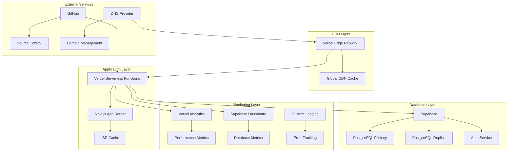

# 🚀 デプロイメント・運用詳細仕様

## 概要
Masa Flash英単語学習アプリケーションのデプロイメント・運用詳細仕様書です。CI/CD、インフラ構成、監視、災害復旧、セキュリティ運用について詳細に記載しています。

## インフラストラクチャ構成

### 全体アーキテクチャ図



## デプロイメント戦略

### 1. 環境構成

#### Production Environment
```yaml
# vercel.json (Production)
{
  "version": 2,
  "framework": "nextjs",
  "buildCommand": "npm run build",
  "outputDirectory": ".next",
  "installCommand": "npm ci",
  "functions": {
    "app/api/**/*.ts": {
      "maxDuration": 30,
      "memory": 1024
    }
  },
  "headers": [
    {
      "source": "/(.*)",
      "headers": [
        {
          "key": "X-Frame-Options",
          "value": "DENY"
        },
        {
          "key": "X-Content-Type-Options", 
          "value": "nosniff"
        },
        {
          "key": "Referrer-Policy",
          "value": "origin-when-cross-origin"
        },
        {
          "key": "Strict-Transport-Security",
          "value": "max-age=31536000; includeSubDomains"
        }
      ]
    },
    {
      "source": "/api/(.*)",
      "headers": [
        {
          "key": "Cache-Control",
          "value": "public, max-age=300, s-maxage=900"
        }
      ]
    },
    {
      "source": "/_next/static/(.*)",
      "headers": [
        {
          "key": "Cache-Control",
          "value": "public, max-age=31536000, immutable"
        }
      ]
    }
  ],
  "redirects": [
    {
      "source": "/home",
      "destination": "/protected",
      "permanent": true
    }
  ],
  "rewrites": [
    {
      "source": "/health",
      "destination": "/api/health"
    }
  ]
}
```

#### Staging Environment
```yaml
# vercel.staging.json
{
  "version": 2,
  "framework": "nextjs",
  "buildCommand": "npm run build",
  "functions": {
    "app/api/**/*.ts": {
      "maxDuration": 10,
      "memory": 512
    }
  },
  "env": {
    "NEXT_PUBLIC_ENVIRONMENT": "staging",
    "REVALIDATION_INTERVAL": "300"
  }
}
```

### 2. CI/CD パイプライン

#### GitHub Actions Workflow
```yaml
# .github/workflows/deploy.yml
name: Deploy to Vercel

on:
  push:
    branches: [main, develop]
  pull_request:
    branches: [main]

env:
  VERCEL_ORG_ID: ${{ secrets.VERCEL_ORG_ID }}
  VERCEL_PROJECT_ID: ${{ secrets.VERCEL_PROJECT_ID }}

jobs:
  lint-and-test:
    runs-on: ubuntu-latest
    
    steps:
      - name: Checkout
        uses: actions/checkout@v4
        
      - name: Setup Node.js
        uses: actions/setup-node@v4
        with:
          node-version: '20'
          cache: 'npm'
          
      - name: Install dependencies
        run: npm ci
        
      - name: Run ESLint
        run: npm run lint
        
      - name: Run type check
        run: npm run type-check
        
      - name: Run tests
        run: npm run test
        
      - name: Build application
        run: npm run build
        env:
          NEXT_PUBLIC_SUPABASE_URL: ${{ secrets.NEXT_PUBLIC_SUPABASE_URL }}
          NEXT_PUBLIC_SUPABASE_ANON_KEY: ${{ secrets.NEXT_PUBLIC_SUPABASE_ANON_KEY }}

  security-scan:
    runs-on: ubuntu-latest
    needs: lint-and-test
    
    steps:
      - name: Checkout
        uses: actions/checkout@v4
        
      - name: Run security audit
        run: npm audit --audit-level high
        
      - name: Check for vulnerabilities
        run: npm audit --production --audit-level moderate

  deploy-staging:
    runs-on: ubuntu-latest
    needs: [lint-and-test, security-scan]
    if: github.ref == 'refs/heads/develop'
    
    steps:
      - name: Checkout
        uses: actions/checkout@v4
        
      - name: Install Vercel CLI
        run: npm install --global vercel@latest
        
      - name: Pull Vercel Environment Information
        run: vercel pull --yes --environment=preview --token=${{ secrets.VERCEL_TOKEN }}
        
      - name: Build Project Artifacts
        run: vercel build --token=${{ secrets.VERCEL_TOKEN }}
        
      - name: Deploy to Vercel
        run: vercel deploy --prebuilt --token=${{ secrets.VERCEL_TOKEN }}
        
      - name: Run E2E tests on staging
        run: npm run test:e2e
        env:
          BASE_URL: ${{ steps.deploy.outputs.url }}

  deploy-production:
    runs-on: ubuntu-latest
    needs: [lint-and-test, security-scan]
    if: github.ref == 'refs/heads/main'
    
    steps:
      - name: Checkout
        uses: actions/checkout@v4
        
      - name: Install Vercel CLI
        run: npm install --global vercel@latest
        
      - name: Pull Vercel Environment Information
        run: vercel pull --yes --environment=production --token=${{ secrets.VERCEL_TOKEN }}
        
      - name: Build Project Artifacts
        run: vercel build --prod --token=${{ secrets.VERCEL_TOKEN }}
        
      - name: Deploy to Vercel
        id: deploy
        run: vercel deploy --prebuilt --prod --token=${{ secrets.VERCEL_TOKEN }}
        
      - name: Run smoke tests
        run: npm run test:smoke
        env:
          BASE_URL: https://masa-flash.vercel.app
          
      - name: Notify deployment
        uses: 8398a7/action-slack@v3
        with:
          status: ${{ job.status }}
          text: "🚀 Production deployment completed: ${{ steps.deploy.outputs.url }}"
        env:
          SLACK_WEBHOOK_URL: ${{ secrets.SLACK_WEBHOOK_URL }}

  post-deploy:
    runs-on: ubuntu-latest
    needs: [deploy-production]
    if: github.ref == 'refs/heads/main'
    
    steps:
      - name: Warm up cache
        run: |
          curl -s https://masa-flash.vercel.app/api/health
          curl -s https://masa-flash.vercel.app/api/static-data
          curl -s https://masa-flash.vercel.app/landing
          
      - name: Update deployment status
        run: |
          curl -X POST https://api.github.com/repos/${{ github.repository }}/deployments \
            -H "Authorization: token ${{ secrets.GITHUB_TOKEN }}" \
            -d '{"ref":"${{ github.sha }}","environment":"production","description":"Deployed to Vercel"}'
```

### 3. 環境変数管理

#### Production環境
```bash
# Vercel Environment Variables (Production)
NEXT_PUBLIC_SUPABASE_URL=https://xxx.supabase.co
NEXT_PUBLIC_SUPABASE_ANON_KEY=eyJxxx
SUPABASE_SERVICE_ROLE_KEY=eyJxxx
REVALIDATION_TOKEN=prod-secure-token-xxx
NEXT_PUBLIC_BASE_URL=https://masa-flash.vercel.app
NEXT_PUBLIC_ENVIRONMENT=production

# Analytics & Monitoring
VERCEL_ANALYTICS_ID=xxx
SENTRY_DSN=https://xxx@sentry.io/xxx

# Feature Flags
NEXT_PUBLIC_ENABLE_PWA=true
NEXT_PUBLIC_ENABLE_ANALYTICS=true
```

#### Staging環境
```bash
# Vercel Environment Variables (Staging)
NEXT_PUBLIC_SUPABASE_URL=https://xxx-staging.supabase.co
NEXT_PUBLIC_SUPABASE_ANON_KEY=eyJxxx
SUPABASE_SERVICE_ROLE_KEY=eyJxxx
REVALIDATION_TOKEN=staging-token-xxx
NEXT_PUBLIC_BASE_URL=https://masa-flash-staging.vercel.app
NEXT_PUBLIC_ENVIRONMENT=staging

# Debug Settings
NEXT_PUBLIC_DEBUG_MODE=true
NEXT_PUBLIC_ENABLE_ANALYTICS=false
```

## 監視・観測可能性

### 1. アプリケーション監視

#### Vercel Analytics 統合
```typescript
// lib/analytics.ts
import { Analytics } from '@vercel/analytics/react';
import { SpeedInsights } from '@vercel/speed-insights/next';

export function AnalyticsProvider({ children }: { children: React.ReactNode }) {
  return (
    <>
      {children}
      <Analytics />
      <SpeedInsights />
    </>
  );
}

// カスタムイベント追跡
export function trackEvent(eventName: string, properties?: Record<string, any>) {
  if (typeof window !== 'undefined' && window.va) {
    window.va('track', eventName, properties);
  }
}

// 使用例
trackEvent('study_session_completed', {
  category: 'verb',
  mode: 'flashcard',
  accuracy: 0.85,
  duration: 180
});
```

#### カスタムメトリクス収集
```typescript
// lib/metrics.ts
interface Metric {
  name: string;
  value: number;
  unit: string;
  timestamp: string;
  tags?: Record<string, string>;
}

class MetricsCollector {
  private metrics: Metric[] = [];
  private batchSize = 10;
  private flushInterval = 30000; // 30秒
  
  constructor() {
    if (typeof window !== 'undefined') {
      setInterval(() => this.flush(), this.flushInterval);
    }
  }
  
  record(name: string, value: number, unit: string = 'count', tags?: Record<string, string>) {
    this.metrics.push({
      name,
      value,
      unit,
      timestamp: new Date().toISOString(),
      tags
    });
    
    if (this.metrics.length >= this.batchSize) {
      this.flush();
    }
  }
  
  private async flush() {
    if (this.metrics.length === 0) return;
    
    const batch = [...this.metrics];
    this.metrics = [];
    
    try {
      await fetch('/api/metrics', {
        method: 'POST',
        headers: { 'Content-Type': 'application/json' },
        body: JSON.stringify({ metrics: batch })
      });
    } catch (error) {
      console.error('Failed to send metrics:', error);
      // 失敗した場合は次回のバッチに含める
      this.metrics.unshift(...batch);
    }
  }
}

export const metricsCollector = new MetricsCollector();

// 使用例
metricsCollector.record('page_load_time', 1250, 'milliseconds', {
  page: '/protected/category/verb',
  user_type: 'authenticated'
});
```

### 2. エラー監視

#### エラートラッキング設定
```typescript
// lib/error-tracking.ts
interface ErrorContext {
  userId?: string;
  sessionId?: string;
  userAgent?: string;
  url?: string;
  timestamp: string;
  environment: string;
}

class ErrorTracker {
  private static instance: ErrorTracker;
  
  static getInstance(): ErrorTracker {
    if (!ErrorTracker.instance) {
      ErrorTracker.instance = new ErrorTracker();
    }
    return ErrorTracker.instance;
  }
  
  captureException(error: Error, context?: Partial<ErrorContext>) {
    const errorData = {
      message: error.message,
      stack: error.stack,
      name: error.name,
      context: {
        timestamp: new Date().toISOString(),
        environment: process.env.NEXT_PUBLIC_ENVIRONMENT || 'development',
        url: typeof window !== 'undefined' ? window.location.href : undefined,
        userAgent: typeof window !== 'undefined' ? navigator.userAgent : undefined,
        ...context
      }
    };
    
    // コンソールログ
    console.error('Application Error:', errorData);
    
    // 外部サービスに送信（本番環境のみ）
    if (process.env.NEXT_PUBLIC_ENVIRONMENT === 'production') {
      this.sendToErrorService(errorData);
    }
  }
  
  private async sendToErrorService(errorData: any) {
    try {
      await fetch('/api/errors', {
        method: 'POST',
        headers: { 'Content-Type': 'application/json' },
        body: JSON.stringify(errorData)
      });
    } catch (err) {
      console.error('Failed to send error to tracking service:', err);
    }
  }
}

export const errorTracker = ErrorTracker.getInstance();

// React Error Boundary
export class ErrorBoundary extends Component<
  { children: ReactNode; fallback?: ReactNode },
  { hasError: boolean }
> {
  constructor(props: any) {
    super(props);
    this.state = { hasError: false };
  }
  
  static getDerivedStateFromError(error: Error) {
    return { hasError: true };
  }
  
  componentDidCatch(error: Error, errorInfo: ErrorInfo) {
    errorTracker.captureException(error, {
      componentStack: errorInfo.componentStack
    });
  }
  
  render() {
    if (this.state.hasError) {
      return this.props.fallback || (
        <div className="error-fallback">
          <h2>エラーが発生しました</h2>
          <button onClick={() => this.setState({ hasError: false })}>
            再試行
          </button>
        </div>
      );
    }
    
    return this.props.children;
  }
}
```

### 3. パフォーマンス監視

#### Core Web Vitals 追跡
```typescript
// lib/web-vitals.ts
import { getCLS, getFID, getFCP, getLCP, getTTFB } from 'web-vitals';

interface VitalMetric {
  name: string;
  value: number;
  rating: 'good' | 'needs-improvement' | 'poor';
  delta: number;
  id: string;
}

function sendToAnalytics(metric: VitalMetric) {
  // Vercel Analytics に送信
  if (typeof window !== 'undefined' && window.va) {
    window.va('track', 'Web Vital', {
      metric_name: metric.name,
      metric_value: metric.value,
      metric_rating: metric.rating
    });
  }
  
  // カスタムメトリクスに記録
  metricsCollector.record(
    `web_vital_${metric.name.toLowerCase()}`,
    metric.value,
    'milliseconds',
    { rating: metric.rating }
  );
}

// Web Vitals 監視開始
export function startWebVitalsMonitoring() {
  getCLS(sendToAnalytics);
  getFID(sendToAnalytics);
  getFCP(sendToAnalytics);
  getLCP(sendToAnalytics);
  getTTFB(sendToAnalytics);
}

// ページ固有のパフォーマンス測定
export function measurePagePerformance(pageName: string) {
  if (typeof window === 'undefined') return;
  
  const startTime = performance.now();
  
  return {
    end: () => {
      const duration = performance.now() - startTime;
      metricsCollector.record(
        'page_render_time',
        duration,
        'milliseconds',
        { page: pageName }
      );
    }
  };
}
```

## セキュリティ運用

### 1. セキュリティヘッダー設定

#### Content Security Policy
```typescript
// next.config.ts
const securityHeaders = [
  {
    key: 'Content-Security-Policy',
    value: [
      "default-src 'self'",
      "script-src 'self' 'unsafe-eval' 'unsafe-inline' https://va.vercel-scripts.com",
      "style-src 'self' 'unsafe-inline' https://fonts.googleapis.com",
      "font-src 'self' https://fonts.gstatic.com",
      "img-src 'self' data: https:",
      "connect-src 'self' https://*.supabase.co wss://*.supabase.co https://va.vercel-scripts.com",
      "frame-src 'none'",
      "object-src 'none'",
      "base-uri 'self'",
      "form-action 'self'",
      "frame-ancestors 'none'",
      "upgrade-insecure-requests"
    ].join('; ')
  },
  {
    key: 'X-Frame-Options',
    value: 'DENY'
  },
  {
    key: 'X-Content-Type-Options',
    value: 'nosniff'
  },
  {
    key: 'X-XSS-Protection',
    value: '1; mode=block'
  },
  {
    key: 'Referrer-Policy',
    value: 'origin-when-cross-origin'
  },
  {
    key: 'Strict-Transport-Security',
    value: 'max-age=31536000; includeSubDomains; preload'
  },
  {
    key: 'Permissions-Policy',
    value: 'camera=(), microphone=(), geolocation=(), interest-cohort=()'
  }
];

const nextConfig = {
  async headers() {
    return [
      {
        source: '/(.*)',
        headers: securityHeaders,
      },
    ];
  },
};
```

### 2. 依存関係セキュリティ管理

#### 自動セキュリティ監査
```bash
#!/bin/bash
# scripts/security-audit.sh

echo "🔍 Running security audit..."

# npm audit
echo "Running npm audit..."
npm audit --audit-level high

# Check for outdated packages
echo "Checking for outdated packages..."
npm outdated

# Check for known vulnerabilities
echo "Checking for known vulnerabilities..."
npx audit-ci --config audit-ci.json

# License compliance check
echo "Checking license compliance..."
npx license-checker --onlyAllow 'MIT;Apache-2.0;BSD-2-Clause;BSD-3-Clause;ISC'

echo "✅ Security audit completed"
```

#### 依存関係更新戦略
```json
{
  "scripts": {
    "audit": "npm audit --audit-level high",
    "audit:fix": "npm audit fix",
    "update:check": "npm outdated",
    "update:minor": "npx npm-check-updates -u --target minor",
    "update:patch": "npx npm-check-updates -u --target patch",
    "security:scan": "./scripts/security-audit.sh"
  }
}
```

## 災害復旧・事業継続

### 1. バックアップ戦略

#### データベースバックアップ
```sql
-- 日次バックアップスクリプト
-- Supabase CLI を使用
supabase db dump --db-url "$DATABASE_URL" --file "backup_$(date +%Y%m%d).sql"

-- 重要テーブルの差分バックアップ
COPY (
  SELECT * FROM user_progress 
  WHERE updated_at >= NOW() - INTERVAL '1 day'
) TO '/backups/user_progress_delta.csv' WITH CSV HEADER;

-- 設定データのバックアップ
COPY (SELECT * FROM categories) TO '/backups/categories.csv' WITH CSV HEADER;
COPY (SELECT * FROM words) TO '/backups/words.csv' WITH CSV HEADER;
```

#### アプリケーションバックアップ
```bash
#!/bin/bash
# scripts/backup-application.sh

DATE=$(date +%Y%m%d_%H%M%S)
BACKUP_DIR="./backups/$DATE"

mkdir -p "$BACKUP_DIR"

# 環境変数バックアップ
echo "Backing up environment variables..."
vercel env pull "$BACKUP_DIR/.env.production"
vercel env pull --environment=staging "$BACKUP_DIR/.env.staging"

# 設定ファイルバックアップ
echo "Backing up configuration files..."
cp next.config.ts "$BACKUP_DIR/"
cp tailwind.config.ts "$BACKUP_DIR/"
cp tsconfig.json "$BACKUP_DIR/"
cp package.json "$BACKUP_DIR/"
cp vercel.json "$BACKUP_DIR/"

# データベーススキーマバックアップ
echo "Backing up database schema..."
supabase db dump --schema-only --db-url "$DATABASE_URL" --file "$BACKUP_DIR/schema.sql"

# 圧縮
echo "Compressing backup..."
tar -czf "backup_$DATE.tar.gz" -C ./backups "$DATE"

echo "✅ Backup completed: backup_$DATE.tar.gz"
```

### 2. 災害復旧手順

#### RTO/RPO 目標
- **RTO (Recovery Time Objective)**: 15分
- **RPO (Recovery Point Objective)**: 5分

#### 復旧プロセス
```bash
#!/bin/bash
# scripts/disaster-recovery.sh

echo "🚨 Starting disaster recovery process..."

# 1. 現在の状況確認
echo "Checking current system status..."
curl -f https://masa-flash.vercel.app/api/health || echo "Primary system down"

# 2. データベース状態確認
echo "Checking database connectivity..."
psql "$DATABASE_URL" -c "SELECT 1;" || echo "Database connection failed"

# 3. バックアップからの復旧
if [ "$1" = "restore-db" ]; then
    echo "Restoring database from backup..."
    LATEST_BACKUP=$(ls -t backups/*.sql | head -1)
    psql "$DATABASE_URL" -f "$LATEST_BACKUP"
fi

# 4. アプリケーション再デプロイ
if [ "$1" = "redeploy" ]; then
    echo "Redeploying application..."
    vercel --prod --token="$VERCEL_TOKEN"
fi

# 5. 動作確認
echo "Running health checks..."
./scripts/health-check.sh

echo "✅ Disaster recovery completed"
```

### 3. 監視・アラート設定

#### アップタイム監視
```typescript
// scripts/uptime-monitor.js
const endpoints = [
  'https://masa-flash.vercel.app',
  'https://masa-flash.vercel.app/api/health',
  'https://masa-flash.vercel.app/api/static-data'
];

async function checkEndpoint(url) {
  try {
    const start = Date.now();
    const response = await fetch(url, { timeout: 10000 });
    const responseTime = Date.now() - start;
    
    return {
      url,
      status: response.status,
      responseTime,
      healthy: response.ok && responseTime < 5000
    };
  } catch (error) {
    return {
      url,
      status: 0,
      responseTime: -1,
      healthy: false,
      error: error.message
    };
  }
}

async function runHealthCheck() {
  const results = await Promise.all(
    endpoints.map(checkEndpoint)
  );
  
  const unhealthyEndpoints = results.filter(r => !r.healthy);
  
  if (unhealthyEndpoints.length > 0) {
    console.error('🚨 Unhealthy endpoints detected:', unhealthyEndpoints);
    
    // Slack通知
    if (process.env.SLACK_WEBHOOK_URL) {
      await fetch(process.env.SLACK_WEBHOOK_URL, {
        method: 'POST',
        headers: { 'Content-Type': 'application/json' },
        body: JSON.stringify({
          text: `🚨 Health check failed for ${unhealthyEndpoints.length} endpoints`,
          attachments: [{
            color: 'danger',
            fields: unhealthyEndpoints.map(e => ({
              title: e.url,
              value: `Status: ${e.status}, Error: ${e.error || 'N/A'}`,
              short: false
            }))
          }]
        })
      });
    }
  } else {
    console.log('✅ All endpoints healthy');
  }
}

// 5分間隔で実行
setInterval(runHealthCheck, 5 * 60 * 1000);
runHealthCheck(); // 初回実行
```

## パフォーマンス最適化

### 1. ビルド最適化

#### Next.js 設定最適化
```typescript
// next.config.ts
const nextConfig = {
  // 実験的機能
  experimental: {
    // パッケージ最適化
    optimizePackageImports: [
      'lucide-react',
      '@radix-ui/react-dropdown-menu',
      '@radix-ui/react-dialog',
      'framer-motion'
    ],
    // Turbopack (開発時)
    turbo: {
      rules: {
        '*.svg': {
          loaders: ['@svgr/webpack'],
          as: '*.js',
        },
      },
    },
  },
  
  // コンパイラ最適化
  compiler: {
    // 本番環境でのconsole.log削除
    removeConsole: process.env.NODE_ENV === 'production' ? {
      exclude: ['error', 'warn']
    } : false,
  },
  
  // 画像最適化
  images: {
    formats: ['image/webp', 'image/avif'],
    deviceSizes: [640, 750, 828, 1080, 1200, 1920, 2048, 3840],
    imageSizes: [16, 32, 48, 64, 96, 128, 256, 384],
    domains: ['supabase.co'],
    minimumCacheTTL: 86400, // 24時間
  },
  
  // バンドル分析
  webpack: (config, { dev, isServer }) => {
    // バンドルアナライザー（開発時）
    if (dev && process.env.ANALYZE === 'true') {
      const { BundleAnalyzerPlugin } = require('webpack-bundle-analyzer');
      config.plugins.push(
        new BundleAnalyzerPlugin({
          analyzerMode: 'server',
          openAnalyzer: true,
        })
      );
    }
    
    return config;
  },
};
```

### 2. キャッシュ戦略最適化

#### ISR設定の詳細化
```typescript
// app/protected/category/[category]/page.tsx
export const revalidate = 3600; // 1時間

export async function generateStaticParams() {
  const categories = await dataProvider.getCategories();
  return categories.map((category) => ({
    category: category.name,
  }));
}

// 動的セグメントの事前生成
export const dynamicParams = true;

// メタデータ生成の最適化
export async function generateMetadata({
  params,
}: {
  params: { category: string };
}): Promise<Metadata> {
  const categoryData = await dataProvider.getCategoryData(params.category);
  
  return {
    title: `${categoryData.display_name} - 英単語学習`,
    description: `${categoryData.display_name}カテゴリーの英単語を効率的に学習しましょう。`,
    openGraph: {
      title: `${categoryData.display_name} - Masa Flash`,
      description: categoryData.description,
      type: 'website',
    },
  };
}
```

## 運用自動化

### 1. 定期メンテナンス

#### 自動化スクリプト
```bash
#!/bin/bash
# scripts/maintenance.sh

echo "🔧 Starting maintenance tasks..."

# 1. 依存関係更新チェック
echo "Checking for dependency updates..."
npm outdated > outdated-packages.txt
if [ -s outdated-packages.txt ]; then
    echo "📦 Outdated packages found"
    cat outdated-packages.txt
fi

# 2. セキュリティ監査
echo "Running security audit..."
npm audit --audit-level high

# 3. データベースメンテナンス
echo "Running database maintenance..."
psql "$DATABASE_URL" << EOF
-- 古いセッションデータクリーンアップ
DELETE FROM study_sessions 
WHERE created_at < NOW() - INTERVAL '90 days';

-- 統計情報更新
ANALYZE;

-- インデックス再構築（必要に応じて）
REINDEX INDEX CONCURRENTLY idx_user_progress_user_id;
EOF

# 4. キャッシュクリア
echo "Clearing application cache..."
curl -X POST "$NEXT_PUBLIC_BASE_URL/api/revalidate" \
  -H "Content-Type: application/json" \
  -d "{\"token\":\"$REVALIDATION_TOKEN\",\"clearAll\":true}"

# 5. ヘルスチェック
echo "Running post-maintenance health check..."
./scripts/health-check.sh

echo "✅ Maintenance completed"
```

#### Cron設定
```bash
# crontab -e
# 毎日午前2時に実行
0 2 * * * /path/to/scripts/maintenance.sh >> /var/log/masa-flash-maintenance.log 2>&1

# 毎週日曜日午前3時にフルバックアップ
0 3 * * 0 /path/to/scripts/backup-application.sh >> /var/log/masa-flash-backup.log 2>&1

# 5分間隔でヘルスチェック
*/5 * * * * /path/to/scripts/health-check.sh >> /var/log/masa-flash-health.log 2>&1
```

### 2. 自動スケーリング

#### Vercel Function設定
```typescript
// vercel.json
{
  "functions": {
    "app/api/data/**/*.ts": {
      "maxDuration": 30,
      "memory": 1024,
      "regions": ["nrt1", "iad1"] // 東京、バージニア
    },
    "app/api/health/route.ts": {
      "maxDuration": 10,
      "memory": 512
    }
  },
  "regions": ["nrt1"]
}
```

---

この仕様書は、デプロイメント・運用の詳細と実装指針を包括的にカバーしています。自動化、監視、セキュリティを重視した運用設計となっています。 