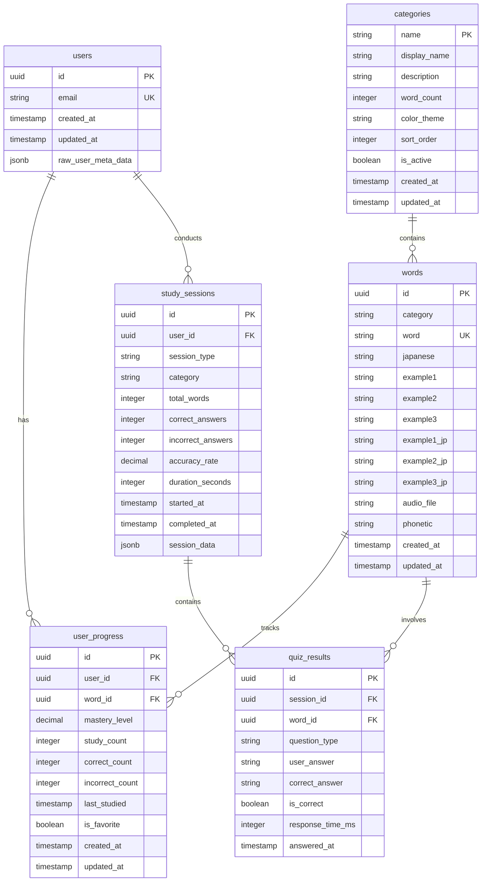

# 🗄️ データベース設計詳細仕様

## 概要
Masa Flash英単語学習アプリケーションのデータベース設計詳細仕様書です。テーブル設計、インデックス戦略、パフォーマンス最適化、データ整合性について詳細に記載しています。

## データベース全体設計

### ER図



## テーブル詳細設計

### 1. users テーブル（Supabase Auth管理）

```sql
-- Supabase Authが自動管理するテーブル
-- 直接操作は行わず、参照のみ
CREATE TABLE auth.users (
  id UUID PRIMARY KEY DEFAULT gen_random_uuid(),
  email TEXT UNIQUE NOT NULL,
  encrypted_password TEXT,
  email_confirmed_at TIMESTAMP WITH TIME ZONE,
  invited_at TIMESTAMP WITH TIME ZONE,
  confirmation_token TEXT,
  confirmation_sent_at TIMESTAMP WITH TIME ZONE,
  recovery_token TEXT,
  recovery_sent_at TIMESTAMP WITH TIME ZONE,
  email_change_token_new TEXT,
  email_change TEXT,
  email_change_sent_at TIMESTAMP WITH TIME ZONE,
  last_sign_in_at TIMESTAMP WITH TIME ZONE,
  raw_app_meta_data JSONB,
  raw_user_meta_data JSONB,
  is_super_admin BOOLEAN,
  created_at TIMESTAMP WITH TIME ZONE DEFAULT NOW(),
  updated_at TIMESTAMP WITH TIME ZONE DEFAULT NOW()
);
```

### 2. words テーブル（単語マスターデータ）

```sql
CREATE TABLE public.words (
  id UUID PRIMARY KEY DEFAULT gen_random_uuid(),
  category TEXT NOT NULL,
  word TEXT NOT NULL UNIQUE,
  japanese TEXT NOT NULL,
  example1 TEXT NOT NULL,
  example2 TEXT NOT NULL,
  example3 TEXT NOT NULL,
  example1_jp TEXT NOT NULL,
  example2_jp TEXT NOT NULL,
  example3_jp TEXT NOT NULL,
  audio_file TEXT,
  phonetic TEXT,
  difficulty_level INTEGER DEFAULT 1 CHECK (difficulty_level BETWEEN 1 AND 5),
  frequency_rank INTEGER,
  tags TEXT[],
  created_at TIMESTAMP WITH TIME ZONE DEFAULT NOW(),
  updated_at TIMESTAMP WITH TIME ZONE DEFAULT NOW(),
  
  -- 制約
  CONSTRAINT words_word_format CHECK (word ~ '^[a-zA-Z\s\-'']+$'),
  CONSTRAINT words_examples_not_empty CHECK (
    LENGTH(example1) > 0 AND 
    LENGTH(example2) > 0 AND 
    LENGTH(example3) > 0
  )
);

-- インデックス
CREATE INDEX idx_words_category ON words(category);
CREATE INDEX idx_words_difficulty ON words(difficulty_level);
CREATE INDEX idx_words_frequency ON words(frequency_rank) WHERE frequency_rank IS NOT NULL;
CREATE INDEX idx_words_tags ON words USING GIN(tags);
CREATE INDEX idx_words_created_at ON words(created_at);

-- 全文検索インデックス
CREATE INDEX idx_words_fulltext ON words USING GIN(
  to_tsvector('english', word || ' ' || japanese || ' ' || example1 || ' ' || example2 || ' ' || example3)
);

-- RLS (Row Level Security)
ALTER TABLE words ENABLE ROW LEVEL SECURITY;
CREATE POLICY "Words are viewable by everyone" ON words FOR SELECT USING (true);
CREATE POLICY "Only admins can modify words" ON words FOR ALL 
  USING (auth.jwt() ->> 'role' = 'admin');
```

### 3. user_progress テーブル（学習進捗）

```sql
CREATE TABLE public.user_progress (
  id UUID PRIMARY KEY DEFAULT gen_random_uuid(),
  user_id UUID NOT NULL REFERENCES auth.users(id) ON DELETE CASCADE,
  word_id UUID NOT NULL REFERENCES words(id) ON DELETE CASCADE,
  mastery_level DECIMAL(3,2) NOT NULL DEFAULT 0.0 CHECK (mastery_level BETWEEN 0.0 AND 1.0),
  study_count INTEGER NOT NULL DEFAULT 0 CHECK (study_count >= 0),
  correct_count INTEGER NOT NULL DEFAULT 0 CHECK (correct_count >= 0),
  incorrect_count INTEGER NOT NULL DEFAULT 0 CHECK (incorrect_count >= 0),
  last_studied TIMESTAMP WITH TIME ZONE,
  is_favorite BOOLEAN NOT NULL DEFAULT false,
  next_review_at TIMESTAMP WITH TIME ZONE,
  review_interval_days INTEGER DEFAULT 1,
  ease_factor DECIMAL(3,2) DEFAULT 2.5 CHECK (ease_factor >= 1.3),
  created_at TIMESTAMP WITH TIME ZONE DEFAULT NOW(),
  updated_at TIMESTAMP WITH TIME ZONE DEFAULT NOW(),
  
  -- 複合ユニーク制約
  CONSTRAINT user_progress_user_word_unique UNIQUE (user_id, word_id),
  
  -- 論理制約
  CONSTRAINT user_progress_counts_valid CHECK (
    correct_count + incorrect_count <= study_count
  )
);

-- インデックス
CREATE INDEX idx_user_progress_user_id ON user_progress(user_id);
CREATE INDEX idx_user_progress_word_id ON user_progress(word_id);
CREATE INDEX idx_user_progress_mastery ON user_progress(mastery_level DESC);
CREATE INDEX idx_user_progress_last_studied ON user_progress(last_studied DESC);
CREATE INDEX idx_user_progress_favorites ON user_progress(user_id, is_favorite) WHERE is_favorite = true;
CREATE INDEX idx_user_progress_review_due ON user_progress(next_review_at) WHERE next_review_at <= NOW();

-- 複合インデックス
CREATE INDEX idx_user_progress_user_mastery ON user_progress(user_id, mastery_level DESC);
CREATE INDEX idx_user_progress_user_studied ON user_progress(user_id, last_studied DESC NULLS LAST);

-- RLS
ALTER TABLE user_progress ENABLE ROW LEVEL SECURITY;
CREATE POLICY "Users can view own progress" ON user_progress 
  FOR SELECT USING (auth.uid() = user_id);
CREATE POLICY "Users can insert own progress" ON user_progress 
  FOR INSERT WITH CHECK (auth.uid() = user_id);
CREATE POLICY "Users can update own progress" ON user_progress 
  FOR UPDATE USING (auth.uid() = user_id);
CREATE POLICY "Users can delete own progress" ON user_progress 
  FOR DELETE USING (auth.uid() = user_id);
```

### 4. study_sessions テーブル（学習セッション履歴）

```sql
CREATE TABLE public.study_sessions (
  id UUID PRIMARY KEY DEFAULT gen_random_uuid(),
  user_id UUID NOT NULL REFERENCES auth.users(id) ON DELETE CASCADE,
  session_type TEXT NOT NULL CHECK (session_type IN ('flashcard', 'quiz', 'review')),
  category TEXT NOT NULL,
  total_words INTEGER NOT NULL CHECK (total_words > 0),
  correct_answers INTEGER NOT NULL DEFAULT 0 CHECK (correct_answers >= 0),
  incorrect_answers INTEGER NOT NULL DEFAULT 0 CHECK (incorrect_answers >= 0),
  accuracy_rate DECIMAL(5,2) GENERATED ALWAYS AS (
    CASE 
      WHEN (correct_answers + incorrect_answers) = 0 THEN 0
      ELSE (correct_answers::decimal / (correct_answers + incorrect_answers)) * 100
    END
  ) STORED,
  duration_seconds INTEGER CHECK (duration_seconds > 0),
  started_at TIMESTAMP WITH TIME ZONE NOT NULL DEFAULT NOW(),
  completed_at TIMESTAMP WITH TIME ZONE,
  session_data JSONB DEFAULT '{}',
  created_at TIMESTAMP WITH TIME ZONE DEFAULT NOW(),
  
  -- 制約
  CONSTRAINT study_sessions_answers_valid CHECK (
    correct_answers + incorrect_answers <= total_words
  ),
  CONSTRAINT study_sessions_completion_valid CHECK (
    (completed_at IS NULL) OR (completed_at >= started_at)
  )
) PARTITION BY RANGE (started_at);

-- 月次パーティション（例：2024年1月）
CREATE TABLE study_sessions_2024_01 PARTITION OF study_sessions
FOR VALUES FROM ('2024-01-01') TO ('2024-02-01');

-- インデックス（各パーティションに作成）
CREATE INDEX idx_study_sessions_user_id ON study_sessions(user_id);
CREATE INDEX idx_study_sessions_type ON study_sessions(session_type);
CREATE INDEX idx_study_sessions_category ON study_sessions(category);
CREATE INDEX idx_study_sessions_started_at ON study_sessions(started_at DESC);
CREATE INDEX idx_study_sessions_accuracy ON study_sessions(accuracy_rate DESC);

-- 複合インデックス
CREATE INDEX idx_study_sessions_user_type_date ON study_sessions(user_id, session_type, started_at DESC);

-- RLS
ALTER TABLE study_sessions ENABLE ROW LEVEL SECURITY;
CREATE POLICY "Users can view own sessions" ON study_sessions 
  FOR SELECT USING (auth.uid() = user_id);
CREATE POLICY "Users can insert own sessions" ON study_sessions 
  FOR INSERT WITH CHECK (auth.uid() = user_id);
CREATE POLICY "Users can update own sessions" ON study_sessions 
  FOR UPDATE USING (auth.uid() = user_id);
```

### 5. quiz_results テーブル（クイズ結果詳細）

```sql
CREATE TABLE public.quiz_results (
  id UUID PRIMARY KEY DEFAULT gen_random_uuid(),
  session_id UUID NOT NULL REFERENCES study_sessions(id) ON DELETE CASCADE,
  word_id UUID NOT NULL REFERENCES words(id) ON DELETE CASCADE,
  question_type TEXT NOT NULL CHECK (question_type IN ('meaning', 'example', 'pronunciation')),
  user_answer TEXT NOT NULL,
  correct_answer TEXT NOT NULL,
  is_correct BOOLEAN NOT NULL,
  response_time_ms INTEGER CHECK (response_time_ms > 0),
  difficulty_perceived INTEGER CHECK (difficulty_perceived BETWEEN 1 AND 5),
  answered_at TIMESTAMP WITH TIME ZONE NOT NULL DEFAULT NOW(),
  
  -- インデックス
  INDEX idx_quiz_results_session ON (session_id),
  INDEX idx_quiz_results_word ON (word_id),
  INDEX idx_quiz_results_correct ON (is_correct),
  INDEX idx_quiz_results_answered_at ON (answered_at DESC)
);

-- RLS
ALTER TABLE quiz_results ENABLE ROW LEVEL SECURITY;
CREATE POLICY "Users can view own quiz results" ON quiz_results 
  FOR SELECT USING (
    EXISTS (
      SELECT 1 FROM study_sessions 
      WHERE study_sessions.id = quiz_results.session_id 
      AND study_sessions.user_id = auth.uid()
    )
  );
```

### 6. categories テーブル（カテゴリマスター）

```sql
CREATE TABLE public.categories (
  name TEXT PRIMARY KEY,
  display_name TEXT NOT NULL,
  description TEXT,
  word_count INTEGER NOT NULL DEFAULT 0 CHECK (word_count >= 0),
  color_theme TEXT DEFAULT '#3B82F6',
  icon_name TEXT,
  sort_order INTEGER NOT NULL DEFAULT 0,
  is_active BOOLEAN NOT NULL DEFAULT true,
  created_at TIMESTAMP WITH TIME ZONE DEFAULT NOW(),
  updated_at TIMESTAMP WITH TIME ZONE DEFAULT NOW(),
  
  -- 制約
  CONSTRAINT categories_name_format CHECK (name ~ '^[a-z_]+$'),
  CONSTRAINT categories_color_format CHECK (color_theme ~ '^#[0-9A-Fa-f]{6}$')
);

-- インデックス
CREATE INDEX idx_categories_active_sort ON categories(sort_order) WHERE is_active = true;
CREATE INDEX idx_categories_word_count ON categories(word_count DESC);

-- RLS
ALTER TABLE categories ENABLE ROW LEVEL SECURITY;
CREATE POLICY "Categories are viewable by everyone" ON categories FOR SELECT USING (true);
CREATE POLICY "Only admins can modify categories" ON categories FOR ALL 
  USING (auth.jwt() ->> 'role' = 'admin');
```

## ビュー定義

### 1. ユーザー学習統計ビュー

```sql
CREATE OR REPLACE VIEW user_learning_stats AS
SELECT 
  up.user_id,
  COUNT(*) as total_words_studied,
  COUNT(*) FILTER (WHERE up.mastery_level >= 0.8) as mastered_words,
  COUNT(*) FILTER (WHERE up.is_favorite = true) as favorite_words,
  AVG(up.mastery_level) as average_mastery,
  MAX(up.last_studied) as last_study_date,
  SUM(up.study_count) as total_study_sessions,
  SUM(up.correct_count) as total_correct_answers,
  SUM(up.incorrect_count) as total_incorrect_answers,
  CASE 
    WHEN SUM(up.study_count) = 0 THEN 0
    ELSE (SUM(up.correct_count)::decimal / SUM(up.study_count)) * 100
  END as overall_accuracy
FROM user_progress up
GROUP BY up.user_id;

-- RLS for view
ALTER VIEW user_learning_stats ENABLE ROW LEVEL SECURITY;
CREATE POLICY "Users can view own learning stats" ON user_learning_stats
  FOR SELECT USING (auth.uid() = user_id);
```

### 2. カテゴリー別進捗ビュー

```sql
CREATE OR REPLACE VIEW user_category_progress AS
SELECT 
  up.user_id,
  w.category,
  COUNT(*) as words_in_category,
  COUNT(*) FILTER (WHERE up.mastery_level >= 0.8) as mastered_in_category,
  AVG(up.mastery_level) as category_mastery_avg,
  MAX(up.last_studied) as last_studied_in_category,
  SUM(up.study_count) as total_studies_in_category
FROM user_progress up
JOIN words w ON up.word_id = w.id
GROUP BY up.user_id, w.category;
```

### 3. 復習対象単語ビュー

```sql
CREATE OR REPLACE VIEW words_due_for_review AS
SELECT 
  up.user_id,
  up.word_id,
  w.word,
  w.japanese,
  w.category,
  up.mastery_level,
  up.next_review_at,
  up.review_interval_days,
  CASE 
    WHEN up.next_review_at <= NOW() THEN 'due'
    WHEN up.next_review_at <= NOW() + INTERVAL '1 day' THEN 'soon'
    ELSE 'future'
  END as review_status
FROM user_progress up
JOIN words w ON up.word_id = w.id
WHERE up.next_review_at IS NOT NULL;
```

## 関数・ストアドプロシージャ

### 1. 習熟度更新関数

```sql
CREATE OR REPLACE FUNCTION update_mastery_level(
  p_user_id UUID,
  p_word_id UUID,
  p_is_correct BOOLEAN,
  p_difficulty INTEGER DEFAULT 3
)
RETURNS DECIMAL AS $$
DECLARE
  current_progress user_progress%ROWTYPE;
  new_mastery_level DECIMAL;
  new_ease_factor DECIMAL;
  new_interval_days INTEGER;
BEGIN
  -- 現在の進捗を取得
  SELECT * INTO current_progress 
  FROM user_progress 
  WHERE user_id = p_user_id AND word_id = p_word_id;
  
  -- 進捗レコードが存在しない場合は作成
  IF NOT FOUND THEN
    INSERT INTO user_progress (user_id, word_id, study_count, correct_count, incorrect_count)
    VALUES (p_user_id, p_word_id, 0, 0, 0);
    
    SELECT * INTO current_progress 
    FROM user_progress 
    WHERE user_id = p_user_id AND word_id = p_word_id;
  END IF;
  
  -- SM-2アルゴリズムベースの習熟度計算
  IF p_is_correct THEN
    new_ease_factor := GREATEST(1.3, current_progress.ease_factor + (0.1 - (5 - p_difficulty) * (0.08 + (5 - p_difficulty) * 0.02)));
    new_interval_days := CEIL(current_progress.review_interval_days * new_ease_factor);
    new_mastery_level := LEAST(1.0, current_progress.mastery_level + 0.1);
  ELSE
    new_ease_factor := GREATEST(1.3, current_progress.ease_factor - 0.2);
    new_interval_days := 1;
    new_mastery_level := GREATEST(0.0, current_progress.mastery_level - 0.2);
  END IF;
  
  -- 進捗を更新
  UPDATE user_progress SET
    study_count = study_count + 1,
    correct_count = correct_count + CASE WHEN p_is_correct THEN 1 ELSE 0 END,
    incorrect_count = incorrect_count + CASE WHEN p_is_correct THEN 0 ELSE 1 END,
    mastery_level = new_mastery_level,
    ease_factor = new_ease_factor,
    review_interval_days = new_interval_days,
    next_review_at = NOW() + (new_interval_days || ' days')::INTERVAL,
    last_studied = NOW(),
    updated_at = NOW()
  WHERE user_id = p_user_id AND word_id = p_word_id;
  
  RETURN new_mastery_level;
END;
$$ LANGUAGE plpgsql SECURITY DEFINER;
```

### 2. クイズ問題生成関数

```sql
CREATE OR REPLACE FUNCTION generate_quiz_options(
  p_correct_word_id UUID,
  p_question_type TEXT DEFAULT 'meaning'
)
RETURNS TEXT[] AS $$
DECLARE
  correct_answer TEXT;
  wrong_options TEXT[];
  all_options TEXT[];
  word_category TEXT;
BEGIN
  -- 正解を取得
  SELECT 
    CASE 
      WHEN p_question_type = 'meaning' THEN japanese
      WHEN p_question_type = 'word' THEN word
      ELSE japanese
    END,
    category
  INTO correct_answer, word_category
  FROM words WHERE id = p_correct_word_id;
  
  -- 同じカテゴリーから間違い選択肢を取得
  SELECT ARRAY(
    SELECT 
      CASE 
        WHEN p_question_type = 'meaning' THEN japanese
        WHEN p_question_type = 'word' THEN word
        ELSE japanese
      END
    FROM words 
    WHERE category = word_category 
    AND id != p_correct_word_id
    ORDER BY RANDOM()
    LIMIT 3
  ) INTO wrong_options;
  
  -- 選択肢をシャッフル
  all_options := ARRAY[correct_answer] || wrong_options;
  
  -- Fisher-Yates シャッフル
  FOR i IN REVERSE array_length(all_options, 1)..2 LOOP
    all_options := array_swap(all_options, i, 1 + (random() * (i-1))::int);
  END LOOP;
  
  RETURN all_options;
END;
$$ LANGUAGE plpgsql;
```

## トリガー関数

### 1. 更新日時自動更新

```sql
CREATE OR REPLACE FUNCTION trigger_set_timestamp()
RETURNS TRIGGER AS $$
BEGIN
  NEW.updated_at = NOW();
  RETURN NEW;
END;
$$ LANGUAGE plpgsql;

-- 各テーブルにトリガーを設定
CREATE TRIGGER set_timestamp_words
  BEFORE UPDATE ON words
  FOR EACH ROW
  EXECUTE FUNCTION trigger_set_timestamp();

CREATE TRIGGER set_timestamp_user_progress
  BEFORE UPDATE ON user_progress
  FOR EACH ROW
  EXECUTE FUNCTION trigger_set_timestamp();

CREATE TRIGGER set_timestamp_categories
  BEFORE UPDATE ON categories
  FOR EACH ROW
  EXECUTE FUNCTION trigger_set_timestamp();
```

### 2. カテゴリー単語数自動更新

```sql
CREATE OR REPLACE FUNCTION update_category_word_count()
RETURNS TRIGGER AS $$
BEGIN
  IF TG_OP = 'INSERT' THEN
    UPDATE categories SET word_count = word_count + 1 WHERE name = NEW.category;
    RETURN NEW;
  ELSIF TG_OP = 'DELETE' THEN
    UPDATE categories SET word_count = word_count - 1 WHERE name = OLD.category;
    RETURN OLD;
  ELSIF TG_OP = 'UPDATE' THEN
    IF OLD.category != NEW.category THEN
      UPDATE categories SET word_count = word_count - 1 WHERE name = OLD.category;
      UPDATE categories SET word_count = word_count + 1 WHERE name = NEW.category;
    END IF;
    RETURN NEW;
  END IF;
  RETURN NULL;
END;
$$ LANGUAGE plpgsql;

CREATE TRIGGER trigger_update_category_word_count
  AFTER INSERT OR UPDATE OR DELETE ON words
  FOR EACH ROW
  EXECUTE FUNCTION update_category_word_count();
```

## パフォーマンス最適化

### 1. パーティショニング戦略

```sql
-- 学習セッションの自動パーティション作成
CREATE OR REPLACE FUNCTION create_monthly_partition(table_name TEXT, start_date DATE)
RETURNS VOID AS $$
DECLARE
  partition_name TEXT;
  end_date DATE;
BEGIN
  partition_name := table_name || '_' || to_char(start_date, 'YYYY_MM');
  end_date := start_date + INTERVAL '1 month';
  
  EXECUTE format('CREATE TABLE IF NOT EXISTS %I PARTITION OF %I FOR VALUES FROM (%L) TO (%L)',
    partition_name, table_name, start_date, end_date);
    
  -- インデックスを作成
  EXECUTE format('CREATE INDEX IF NOT EXISTS idx_%s_user_id ON %I(user_id)', 
    partition_name, partition_name);
  EXECUTE format('CREATE INDEX IF NOT EXISTS idx_%s_started_at ON %I(started_at DESC)', 
    partition_name, partition_name);
END;
$$ LANGUAGE plpgsql;

-- 自動パーティション作成のスケジュール
SELECT cron.schedule('create-monthly-partitions', '0 0 1 * *', 
  'SELECT create_monthly_partition(''study_sessions'', date_trunc(''month'', NOW() + INTERVAL ''1 month''));'
);
```

### 2. インデックス最適化

```sql
-- 部分インデックスによる効率化
CREATE INDEX idx_user_progress_needs_review 
ON user_progress(user_id, next_review_at) 
WHERE next_review_at <= NOW() + INTERVAL '1 day';

-- 式インデックス
CREATE INDEX idx_user_progress_accuracy 
ON user_progress((correct_count::float / NULLIF(study_count, 0))) 
WHERE study_count > 0;

-- 複合インデックスの最適化
CREATE INDEX idx_words_category_difficulty_frequency 
ON words(category, difficulty_level, frequency_rank) 
WHERE frequency_rank IS NOT NULL;
```

### 3. クエリ最適化

```sql
-- マテリアライズドビューによる集計の高速化
CREATE MATERIALIZED VIEW user_daily_stats AS
SELECT 
  user_id,
  DATE(started_at) as study_date,
  COUNT(*) as sessions_count,
  SUM(total_words) as words_studied,
  AVG(accuracy_rate) as avg_accuracy,
  SUM(duration_seconds) as total_study_time
FROM study_sessions
WHERE completed_at IS NOT NULL
GROUP BY user_id, DATE(started_at);

-- インデックス
CREATE UNIQUE INDEX idx_user_daily_stats_user_date 
ON user_daily_stats(user_id, study_date);

-- 定期更新
SELECT cron.schedule('refresh-daily-stats', '0 1 * * *', 
  'REFRESH MATERIALIZED VIEW CONCURRENTLY user_daily_stats;'
);
```

## データ整合性・制約

### 1. 複合制約

```sql
-- ユーザー進捗の論理制約
ALTER TABLE user_progress ADD CONSTRAINT check_progress_logic 
CHECK (
  correct_count >= 0 AND 
  incorrect_count >= 0 AND 
  study_count >= correct_count + incorrect_count AND
  mastery_level BETWEEN 0.0 AND 1.0
);

-- セッション結果の整合性
ALTER TABLE study_sessions ADD CONSTRAINT check_session_answers
CHECK (correct_answers + incorrect_answers <= total_words);
```

### 2. 外部キー制約の最適化

```sql
-- カスケード削除の制御
ALTER TABLE user_progress 
  DROP CONSTRAINT user_progress_word_id_fkey,
  ADD CONSTRAINT user_progress_word_id_fkey 
    FOREIGN KEY (word_id) REFERENCES words(id) 
    ON DELETE CASCADE ON UPDATE CASCADE;

-- 論理削除による参照整合性保持
ALTER TABLE words ADD COLUMN deleted_at TIMESTAMP WITH TIME ZONE;
CREATE INDEX idx_words_active ON words(id) WHERE deleted_at IS NULL;
```

## バックアップ・復旧戦略

### 1. 論理バックアップ

```sql
-- 重要テーブルの定期バックアップ
SELECT cron.schedule('backup-user-progress', '0 2 * * *', $$
  COPY (
    SELECT * FROM user_progress 
    WHERE updated_at >= NOW() - INTERVAL '1 day'
  ) TO '/backups/user_progress_' || to_char(NOW(), 'YYYY_MM_DD') || '.csv' 
  WITH CSV HEADER;
$$);
```

### 2. ポイントインタイム復旧

```sql
-- WAL-Eによる継続的アーカイブ（設定例）
-- postgresql.conf
-- wal_level = replica
-- archive_mode = on
-- archive_command = 'wal-e wal-push %p'
-- max_wal_senders = 3
-- checkpoint_segments = 32
```

---

この設計書は、データベースの詳細仕様と運用における重要な考慮事項を包括的にカバーしています。パフォーマンス、セキュリティ、拡張性を重視した設計となっています。 